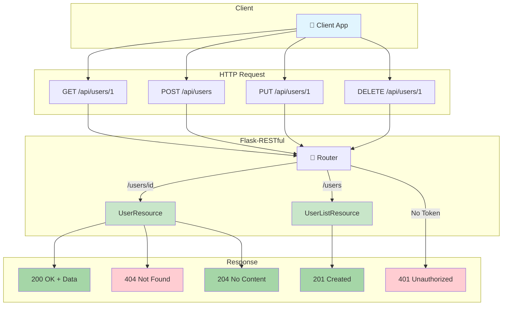

# Flask-RESTful: Interview-Ready Guide

## What is REST API?

**REST** (Representational State Transfer) is a way to build web services where:

- Everything is a **Resource** (User, Product, Order)
- Each resource has a unique **URL** (endpoint)
- You use **HTTP methods** to perform actions
- Data is typically exchanged as **JSON**

**Flask-RESTful** = Flask + tools to build REST APIs easily using Python classes.

---

## The 5 HTTP Methods You Must Know

|Method|What it Does|Example|Returns|
|---|---|---|---|
|**GET**|Read data|Get user profile|200 OK|
|**POST**|Create new|Add new user|201 Created|
|**PUT**|Replace entirely|Update all user fields|200/201|
|**PATCH**|Update partially|Change only email|200 OK|
|**DELETE**|Remove|Delete user|204 No Content|

### Key Interview Question: PUT vs PATCH

```python
# PUT - Must send ALL fields (replaces entire resource)
PUT /users/1
{"name": "John", "email": "john@mail.com", "age": 30}

# PATCH - Send ONLY what changed (partial update)
PATCH /users/1
{"age": 31}  # Only updating age
```

---

## HTTP Status Codes Cheatsheet

```
SUCCESS (2xx)
├── 200 OK          → Request worked, here's the data
├── 201 Created     → New resource created successfully
└── 204 No Content  → Worked, nothing to return (DELETE)

CLIENT ERRORS (4xx)
├── 400 Bad Request    → Your data is wrong/malformed
├── 401 Unauthorized   → Who are you? Login first!
├── 403 Forbidden      → I know you, but you can't do this
├── 404 Not Found      → Resource doesn't exist
└── 422 Unprocessable  → Data format OK, but values invalid

SERVER ERRORS (5xx)
└── 500 Internal Error → Server broke, not your fault
```

### Interview Question: 401 vs 403?

- **401**: "I don't know who you are" (no/invalid token)
- **403**: "I know you, but you're not allowed" (valid login, wrong permissions)

---

## REST Principles (Interview Must-Know)

### 1. Stateless

Each request must contain ALL information needed. Server doesn't remember previous requests.

```python
# ❌ WRONG - Server stores session
session['user_id'] = 123

# ✅ CORRECT - Token sent with every request
headers = {"Authorization": "Bearer eyJhbG..."}
```

### 2. Resource-Based URLs

```python
# ❌ WRONG - Verbs in URL
/getUsers
/deleteUser/1
/updateProduct

# ✅ CORRECT - Nouns only, methods define action
GET    /users      → List users
GET    /users/1    → Get user 1
POST   /users      → Create user
PUT    /users/1    → Replace user 1
DELETE /users/1    → Delete user 1
```

### 3. Idempotent Methods

Same request multiple times = same result

- **Idempotent**: GET, PUT, DELETE
- **Not Idempotent**: POST (creates new resource each time)

---

## Basic Flask-RESTful Structure

```python
from flask import Flask
from flask_restful import Api, Resource

app = Flask(__name__)
api = Api(app)

class UserResource(Resource):
    def get(self, user_id):    # GET /users/<id>
        pass
    def put(self, user_id):    # PUT /users/<id>
        pass
    def delete(self, user_id): # DELETE /users/<id>
        pass

class UserListResource(Resource):
    def get(self):             # GET /users
        pass
    def post(self):            # POST /users
        pass

# Register routes
api.add_resource(UserListResource, '/api/users')
api.add_resource(UserResource, '/api/users/<int:user_id>')
```

---

## Essential Production Features

### 1. Input Validation

```python
from marshmallow import Schema, fields, validate

class UserSchema(Schema):
    name = fields.Str(required=True, validate=validate.Length(min=1))
    email = fields.Email(required=True)
    age = fields.Int(validate=validate.Range(min=0, max=150))
```

### 2. JWT Authentication

```python
from flask_jwt_extended import jwt_required, get_jwt_identity

class ProtectedResource(Resource):
    @jwt_required()
    def get(self):
        current_user = get_jwt_identity()
        return {"user": current_user}
```

### 3. Error Handling

```python
@app.errorhandler(404)
def not_found(error):
    return {"error": "Resource not found"}, 404
```

### 4. Pagination

```python
def get(self):
    page = request.args.get('page', 1, type=int)
    per_page = request.args.get('per_page', 10, type=int)
    
    start = (page - 1) * per_page
    items = all_items[start:start + per_page]
    
    return {"data": items, "page": page, "total": len(all_items)}
```

---

## Security Checklist

1. **HTTPS** - Always encrypt traffic
2. **JWT Tokens** - Stateless authentication
3. **Input Validation** - Never trust user input
4. **Rate Limiting** - Prevent abuse
5. **CORS** - Control allowed origins
6. **Use ORM** - Prevent SQL injection

---

## Project Structure

```
my-api/
├── app.py              # Entry point
├── config.py           # Settings
├── requirements.txt    # Dependencies
├── resources/          # API endpoints
│   ├── users.py
│   └── products.py
├── models/             # Database models
├── schemas/            # Validation
└── tests/              # Test files
```

---

## Quick Interview Answers

**Q: What makes an API RESTful?**

> Uses HTTP methods on resources identified by URLs, stateless, returns standard formats (JSON).

**Q: Why use Flask-RESTful over plain Flask?**

> Organized class-based views, built-in request parsing, automatic JSON responses.

**Q: How do you secure an API?**

> HTTPS, JWT authentication, input validation, rate limiting, CORS configuration.

**Q: What's HATEOAS?**

> Including links to related resources in responses so clients can discover the API.

---

## External Resources

- [Flask-RESTful Docs](https://flask-restful.readthedocs.io/)
- [REST API Best Practices](https://restfulapi.net/)
- [HTTP Status Codes](https://httpstatuses.com/)
- [JWT Introduction](https://jwt.io/introduction)
- [Marshmallow Validation](https://marshmallow.readthedocs.io/)


```python
"""
Flask-RESTful Complete Example
Covers: CRUD, Validation, Pagination, Error Handling, JWT Auth
"""

from flask import Flask, request
from flask_restful import Api, Resource
from flask_cors import CORS
from datetime import datetime
from functools import wraps

# ============ APP SETUP ============
app = Flask(__name__)
app.config['SECRET_KEY'] = 'your-secret-key'
CORS(app)
api = Api(app)

# ============ IN-MEMORY DATABASE ============
USERS = {
    "1": {"id": "1", "name": "Alice", "email": "alice@mail.com", "age": 25},
    "2": {"id": "2", "name": "Bob", "email": "bob@mail.com", "age": 30},
}
TOKENS = {"valid-token-123": "admin"}  # Simple token store

# ============ HELPERS ============
def validate_user(data):
    """Simple validation - returns errors dict or None"""
    errors = {}
    if not data.get('name'):
        errors['name'] = 'Name is required'
    if not data.get('email'):
        errors['email'] = 'Email is required'
    elif '@' not in data.get('email', ''):
        errors['email'] = 'Invalid email format'
    if data.get('age') and not isinstance(data['age'], int):
        errors['age'] = 'Age must be a number'
    return errors if errors else None

def require_auth(f):
    """Simple auth decorator"""
    @wraps(f)
    def decorated(*args, **kwargs):
        token = request.headers.get('Authorization', '').replace('Bearer ', '')
        if token not in TOKENS:
            return {"error": "Unauthorized"}, 401
        return f(*args, **kwargs)
    return decorated

# ============ RESOURCES ============

class UserListResource(Resource):
    """Handle /api/users - Collection operations"""
    
    def get(self):
        """GET /api/users - List all users with pagination"""
        page = request.args.get('page', 1, type=int)
        per_page = request.args.get('per_page', 10, type=int)
        
        all_users = list(USERS.values())
        start = (page - 1) * per_page
        end = start + per_page
        
        return {
            "data": all_users[start:end],
            "pagination": {
                "page": page,
                "per_page": per_page,
                "total": len(all_users),
                "pages": (len(all_users) + per_page - 1) // per_page
            }
        }, 200
    
    def post(self):
        """POST /api/users - Create new user"""
        data = request.get_json() or {}
        
        # Validate input
        errors = validate_user(data)
        if errors:
            return {"errors": errors}, 400
        
        # Create user
        uid = str(len(USERS) + 1)
        USERS[uid] = {
            "id": uid,
            "name": data['name'],
            "email": data['email'],
            "age": data.get('age'),
            "created_at": datetime.utcnow().isoformat()
        }
        return USERS[uid], 201


class UserResource(Resource):
    """Handle /api/users/<id> - Single resource operations"""
    
    def get(self, uid):
        """GET /api/users/<id> - Get single user"""
        if uid not in USERS:
            return {"error": "User not found"}, 404
        return USERS[uid], 200
    
    def put(self, uid):
        """PUT /api/users/<id> - Replace entire user"""
        data = request.get_json() or {}
        
        errors = validate_user(data)
        if errors:
            return {"errors": errors}, 400
        
        USERS[uid] = {
            "id": uid,
            "name": data['name'],
            "email": data['email'],
            "age": data.get('age'),
            "updated_at": datetime.utcnow().isoformat()
        }
        return USERS[uid], 200 if uid in USERS else 201
    
    def patch(self, uid):
        """PATCH /api/users/<id> - Partial update"""
        if uid not in USERS:
            return {"error": "User not found"}, 404
        
        data = request.get_json() or {}
        USERS[uid].update(data)
        USERS[uid]['updated_at'] = datetime.utcnow().isoformat()
        return USERS[uid], 200
    
    def delete(self, uid):
        """DELETE /api/users/<id> - Remove user"""
        if uid not in USERS:
            return {"error": "User not found"}, 404
        del USERS[uid]
        return "", 204


class ProtectedResource(Resource):
    """Example of protected endpoint"""
    method_decorators = [require_auth]
    
    def get(self):
        """GET /api/protected - Requires auth token"""
        return {"message": "You have access!", "secret": "42"}, 200


class HealthResource(Resource):
    """Health check endpoint"""
    def get(self):
        return {"status": "healthy", "timestamp": datetime.utcnow().isoformat()}, 200


# ============ REGISTER ROUTES ============
api.add_resource(HealthResource, '/health')
api.add_resource(UserListResource, '/api/users')
api.add_resource(UserResource, '/api/users/<string:uid>')
api.add_resource(ProtectedResource, '/api/protected')

# ============ ERROR HANDLERS ============
@app.errorhandler(404)
def not_found(e):
    return {"error": "Resource not found"}, 404

@app.errorhandler(500)
def server_error(e):
    return {"error": "Internal server error"}, 500

# ============ RUN ============
if __name__ == '__main__':
    print("\n🚀 Flask-RESTful API Running!")
    print("=" * 40)
    print("Endpoints:")
    print("  GET    /health           - Health check")
    print("  GET    /api/users        - List users")
    print("  POST   /api/users        - Create user")
    print("  GET    /api/users/<id>   - Get user")
    print("  PUT    /api/users/<id>   - Replace user")
    print("  PATCH  /api/users/<id>   - Update user")
    print("  DELETE /api/users/<id>   - Delete user")
    print("  GET    /api/protected    - Auth required")
    print("=" * 40)
    app.run(debug=True, port=5000)


```

# Setup & Testing Instructions

## Quick Setup (3 Steps)

### Step 1: Create Virtual Environment

```bash
# Windows
python -m venv venv
venv\Scripts\activate

# Mac/Linux
python3 -m venv venv
source venv/bin/activate
```

### Step 2: Install Dependencies

```bash
pip install flask flask-restful flask-cors
```

### Step 3: Run the App

```bash
python app.py
```

Server starts at `http://127.0.0.1:5000`

---

## Test with curl Commands

### Health Check

```bash
curl http://127.0.0.1:5000/health
```

### GET - List All Users

```bash
curl http://127.0.0.1:5000/api/users
```

### GET - Single User

```bash
curl http://127.0.0.1:5000/api/users/1
```

### POST - Create User

```bash
curl -X POST http://127.0.0.1:5000/api/users \
  -H "Content-Type: application/json" \
  -d '{"name":"Charlie","email":"charlie@mail.com","age":28}'
```

### PUT - Replace User

```bash
curl -X PUT http://127.0.0.1:5000/api/users/1 \
  -H "Content-Type: application/json" \
  -d '{"name":"Alice Updated","email":"alice.new@mail.com","age":26}'
```

### PATCH - Partial Update

```bash
curl -X PATCH http://127.0.0.1:5000/api/users/1 \
  -H "Content-Type: application/json" \
  -d '{"age":27}'
```

### DELETE - Remove User

```bash
curl -X DELETE http://127.0.0.1:5000/api/users/2
```

### Protected Endpoint (No Token - Returns 401)

```bash
curl http://127.0.0.1:5000/api/protected
```

### Protected Endpoint (With Token - Returns 200)

```bash
curl http://127.0.0.1:5000/api/protected \
  -H "Authorization: Bearer valid-token-123"
```

### Pagination

```bash
curl "http://127.0.0.1:5000/api/users?page=1&per_page=5"
```

---

## Test with Python

```python
import requests

BASE = "http://127.0.0.1:5000/api"

# GET all users
r = requests.get(f"{BASE}/users")
print(r.json())

# POST new user
r = requests.post(f"{BASE}/users", json={
    "name": "Dave", 
    "email": "dave@mail.com"
})
print(r.status_code, r.json())

# Protected (with auth)
r = requests.get(f"{BASE}/protected", 
    headers={"Authorization": "Bearer valid-token-123"})
print(r.json())
```

---

## Expected Responses

|Action|Status|Response|
|---|---|---|
|GET /users|200|`{"data": [...], "pagination": {...}}`|
|GET /users/1|200|`{"id": "1", "name": "Alice", ...}`|
|GET /users/99|404|`{"error": "User not found"}`|
|POST /users|201|Created user object|
|POST /users (invalid)|400|`{"errors": {...}}`|
|DELETE /users/1|204|Empty body|
|GET /protected (no token)|401|`{"error": "Unauthorized"}`|

---

## Concepts Demonstrated

✅ **CRUD Operations** - GET, POST, PUT, PATCH, DELETE  
✅ **Status Codes** - 200, 201, 204, 400, 401, 404  
✅ **Input Validation** - Required fields, email format  
✅ **Pagination** - page & per_page parameters  
✅ **Authentication** - Bearer token check  
✅ **Error Handling** - Custom error responses  
✅ **Resource Classes** - Collection vs Single resource


