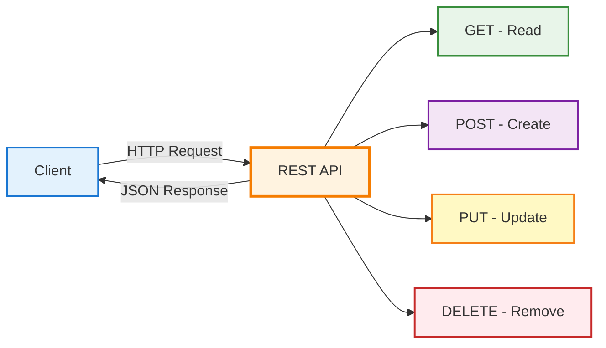
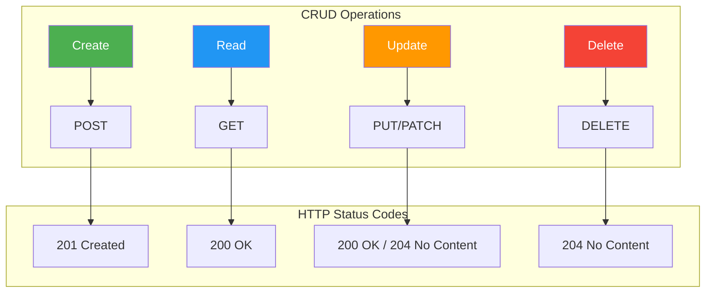
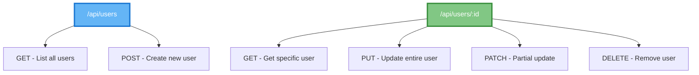

# Flask API Development - Interview Ready Notes

## What is a REST API?

**REST (Representational State Transfer)** is an architectural style for designing networked applications. It uses HTTP methods to perform operations on resources.



## REST Principles (6 Key Constraints)

| Principle                     | Description                      | Example                            |
| ----------------------------- | -------------------------------- | ---------------------------------- |
| **Client-Server**             | Separation of concerns           | Frontend ↔ Backend API             |
| **Stateless**                 | Each request is independent      | No server-side sessions            |
| **Cacheable**                 | Responses can be cached          | ETags, Cache-Control headers       |
| **Uniform Interface**         | Consistent resource URLs         | `/users/123` not `/getUser?id=123` |
| **Layered System**            | Client doesn't know about layers | Load balancers, proxies            |
| **Code on Demand** (optional) | Server can send executable code  | JavaScript sent to browser         |

## HTTP Methods & CRUD Operations



### Common HTTP Status Codes

|Code|Meaning|When to Use|
|---|---|---|
|`200`|OK|Successful GET, PUT, PATCH|
|`201`|Created|Successful POST (resource created)|
|`204`|No Content|Successful DELETE|
|`400`|Bad Request|Invalid input data|
|`401`|Unauthorized|Missing/invalid authentication|
|`403`|Forbidden|Valid auth but no permission|
|`404`|Not Found|Resource doesn't exist|
|`409`|Conflict|Duplicate resource (e.g., email exists)|
|`500`|Internal Server Error|Server-side error|

## JSON Responses in Flask

### Basic JSON Response

```python
from flask import Flask, jsonify

app = Flask(__name__)

@app.route('/api/hello')
def hello():
    return jsonify({'message': 'Hello, World!'})
    
# Response:
# {
#   "message": "Hello, World!"
# }
```

### Why Use `jsonify()`?

✅ **DO USE `jsonify()`:**

- Automatically sets `Content-Type: application/json`
- Handles serialization properly
- Works with Flask's response system

❌ **DON'T USE plain dictionaries** (deprecated in newer Flask versions):

```python
# Old way (avoid)
return {'message': 'Hello'}  
```

## Building a Complete REST API

### Project Structure

```
api_project/
├── app.py
├── config.py
├── models.py
├── routes/
│   ├── __init__.py
│   └── users.py
└── database.py
```

### Example: Users API

```python
# app.py
from flask import Flask, request, jsonify

app = Flask(__name__)

# In-memory database (use real DB in production)
users_db = {}
user_id_counter = 1

# ============ CREATE (POST) ============
@app.route('/api/users', methods=['POST'])
def create_user():
    global user_id_counter
    
    # Get JSON data from request
    data = request.get_json()
    
    # Validation
    if not data or 'name' not in data or 'email' not in data:
        return jsonify({'error': 'Name and email are required'}), 400
    
    # Check for duplicate email
    for user in users_db.values():
        if user['email'] == data['email']:
            return jsonify({'error': 'Email already exists'}), 409
    
    # Create user
    user = {
        'id': user_id_counter,
        'name': data['name'],
        'email': data['email'],
        'age': data.get('age')  # Optional field
    }
    users_db[user_id_counter] = user
    user_id_counter += 1
    
    return jsonify(user), 201  # 201 Created


# ============ READ ALL (GET) ============
@app.route('/api/users', methods=['GET'])
def get_users():
    # Pagination support
    page = request.args.get('page', 1, type=int)
    per_page = request.args.get('per_page', 10, type=int)
    
    users_list = list(users_db.values())
    start = (page - 1) * per_page
    end = start + per_page
    
    return jsonify({
        'users': users_list[start:end],
        'total': len(users_list),
        'page': page,
        'per_page': per_page
    }), 200


# ============ READ ONE (GET) ============
@app.route('/api/users/<int:user_id>', methods=['GET'])
def get_user(user_id):
    user = users_db.get(user_id)
    
    if not user:
        return jsonify({'error': 'User not found'}), 404
    
    return jsonify(user), 200


# ============ UPDATE (PUT) ============
@app.route('/api/users/<int:user_id>', methods=['PUT'])
def update_user(user_id):
    user = users_db.get(user_id)
    
    if not user:
        return jsonify({'error': 'User not found'}), 404
    
    data = request.get_json()
    
    # Validation
    if not data:
        return jsonify({'error': 'No data provided'}), 400
    
    # Update fields
    user['name'] = data.get('name', user['name'])
    user['email'] = data.get('email', user['email'])
    user['age'] = data.get('age', user['age'])
    
    return jsonify(user), 200


# ============ PARTIAL UPDATE (PATCH) ============
@app.route('/api/users/<int:user_id>', methods=['PATCH'])
def patch_user(user_id):
    user = users_db.get(user_id)
    
    if not user:
        return jsonify({'error': 'User not found'}), 404
    
    data = request.get_json()
    
    # Update only provided fields
    if 'name' in data:
        user['name'] = data['name']
    if 'email' in data:
        user['email'] = data['email']
    if 'age' in data:
        user['age'] = data['age']
    
    return jsonify(user), 200


# ============ DELETE (DELETE) ============
@app.route('/api/users/<int:user_id>', methods=['DELETE'])
def delete_user(user_id):
    if user_id not in users_db:
        return jsonify({'error': 'User not found'}), 404
    
    del users_db[user_id]
    
    return '', 204  # No content


# ============ ERROR HANDLERS ============
@app.errorhandler(404)
def not_found(error):
    return jsonify({'error': 'Endpoint not found'}), 404

@app.errorhandler(500)
def internal_error(error):
    return jsonify({'error': 'Internal server error'}), 500


if __name__ == '__main__':
    app.run(debug=True)
```

## RESTful URL Design



### URL Best Practices

✅ **Good URLs:**

```
GET    /api/users              # List all
GET    /api/users/123          # Get one
POST   /api/users              # Create
PUT    /api/users/123          # Update all
PATCH  /api/users/123          # Update partial
DELETE /api/users/123          # Delete
```

❌ **Bad URLs:**

```
GET    /api/getUsers           # Don't use verbs
GET    /api/user?id=123        # Use path params, not query
POST   /api/createUser         # HTTP method defines action
GET    /api/users/delete/123   # Wrong method
```

## Request & Response Examples

### Creating a User (POST)

**Request:**

```bash
curl -X POST http://localhost:5000/api/users \
  -H "Content-Type: application/json" \
  -d '{
    "name": "John Doe",
    "email": "john@example.com",
    "age": 30
  }'
```

**Response (201 Created):**

```json
{
  "id": 1,
  "name": "John Doe",
  "email": "john@example.com",
  "age": 30
}
```

### Getting All Users (GET)

**Request:**

```bash
curl http://localhost:5000/api/users?page=1&per_page=10
```

**Response (200 OK):**

```json
{
  "users": [
    {
      "id": 1,
      "name": "John Doe",
      "email": "john@example.com",
      "age": 30
    }
  ],
  "total": 1,
  "page": 1,
  "per_page": 10
}
```

### Updating a User (PUT)

**Request:**

```bash
curl -X PUT http://localhost:5000/api/users/1 \
  -H "Content-Type: application/json" \
  -d '{
    "name": "John Updated",
    "email": "john.new@example.com",
    "age": 31
  }'
```

**Response (200 OK):**

```json
{
  "id": 1,
  "name": "John Updated",
  "email": "john.new@example.com",
  "age": 31
}
```

### Deleting a User (DELETE)

**Request:**

```bash
curl -X DELETE http://localhost:5000/api/users/1
```

**Response (204 No Content):**

```
(empty response body)
```

## Common Interview Questions

### Q1: What's the difference between PUT and PATCH?

**Answer:**

- **PUT**: Replaces the entire resource. All fields must be provided.
- **PATCH**: Updates only specified fields. Partial update.

```python
# PUT - Must provide all fields
PUT /api/users/1
{
  "name": "John",
  "email": "john@example.com",
  "age": 30
}

# PATCH - Only update age
PATCH /api/users/1
{
  "age": 31
}
```

### Q2: How do you handle errors in Flask APIs?

**Answer:** Use error handlers and return appropriate status codes:

```python
@app.errorhandler(404)
def not_found(error):
    return jsonify({'error': 'Resource not found'}), 404

@app.errorhandler(400)
def bad_request(error):
    return jsonify({'error': 'Invalid request data'}), 400

# In routes
if not user:
    return jsonify({'error': 'User not found'}), 404
```

### Q3: How do you validate JSON input?

**Answer:** Check if data exists and validate required fields:

```python
@app.route('/api/users', methods=['POST'])
def create_user():
    data = request.get_json()
    
    # Check if JSON exists
    if not data:
        return jsonify({'error': 'No JSON data provided'}), 400
    
    # Validate required fields
    if 'name' not in data or 'email' not in data:
        return jsonify({'error': 'Name and email required'}), 400
    
    # Validate email format (basic)
    if '@' not in data['email']:
        return jsonify({'error': 'Invalid email format'}), 400
    
    # Process valid data...
```

### Q4: What is idempotency in REST?

**Answer:** An operation is **idempotent** if calling it multiple times produces the same result.

|Method|Idempotent?|Explanation|
|---|---|---|
|GET|✅ Yes|Reading doesn't change data|
|PUT|✅ Yes|Updating to same value = same result|
|DELETE|✅ Yes|Deleting twice = already deleted|
|POST|❌ No|Creating twice = two resources|
|PATCH|⚠️ Depends|Depends on implementation|

### Q5: How do you implement pagination?

**Answer:** Use query parameters `page` and `per_page`:

```python
@app.route('/api/users')
def get_users():
    page = request.args.get('page', 1, type=int)
    per_page = request.args.get('per_page', 10, type=int)
    
    # Calculate slice
    start = (page - 1) * per_page
    end = start + per_page
    
    users = list(users_db.values())[start:end]
    
    return jsonify({
        'users': users,
        'page': page,
        'per_page': per_page,
        'total': len(users_db)
    })
```

## Advanced Topics

### Content Negotiation

```python
from flask import request

@app.route('/api/users/<int:user_id>')
def get_user(user_id):
    user = users_db.get(user_id)
    
    if not user:
        return jsonify({'error': 'Not found'}), 404
    
    # Check Accept header
    if request.headers.get('Accept') == 'application/xml':
        # Return XML (not common anymore)
        return f'<user><name>{user["name"]}</name></user>'
    
    return jsonify(user)  # Default to JSON
```

### CORS (Cross-Origin Resource Sharing)

```python
from flask_cors import CORS

app = Flask(__name__)
CORS(app)  # Enable CORS for all routes

# Or specific routes
@app.route('/api/users')
@cross_origin()
def get_users():
    return jsonify(users)
```

### Rate Limiting

```python
from flask_limiter import Limiter

limiter = Limiter(app, key_func=lambda: request.remote_addr)

@app.route('/api/users')
@limiter.limit("100 per hour")
def get_users():
    return jsonify(users)
```

## Best Practices Summary

✅ **DO:**

- Use proper HTTP methods and status codes
- Version your API (`/api/v1/users`)
- Validate all input data
- Return consistent JSON structure
- Use plural nouns for resources (`/users` not `/user`)
- Implement pagination for lists
- Handle errors gracefully
- Use `jsonify()` for responses

❌ **DON'T:**

- Use verbs in URLs
- Return HTML from API endpoints
- Ignore HTTP status codes
- Expose internal IDs carelessly
- Return inconsistent response formats
- Forget authentication/authorization
- Skip input validation

## Quick Testing Commands

```bash
# Install httpie (better than curl)
pip install httpie

# Create user
http POST localhost:5000/api/users name="John" email="john@test.com" age=30

# Get all users
http GET localhost:5000/api/users

# Get specific user
http GET localhost:5000/api/users/1

# Update user
http PUT localhost:5000/api/users/1 name="John Updated" email="john@test.com" age=31

# Partial update
http PATCH localhost:5000/api/users/1 age=32

# Delete user
http DELETE localhost:5000/api/users/1
```

## One-Liner for Interviews

_"A REST API is an architectural style that uses HTTP methods (GET, POST, PUT, DELETE) to perform CRUD operations on resources, returning data in JSON format with appropriate status codes, following principles like statelessness and uniform interface design."_