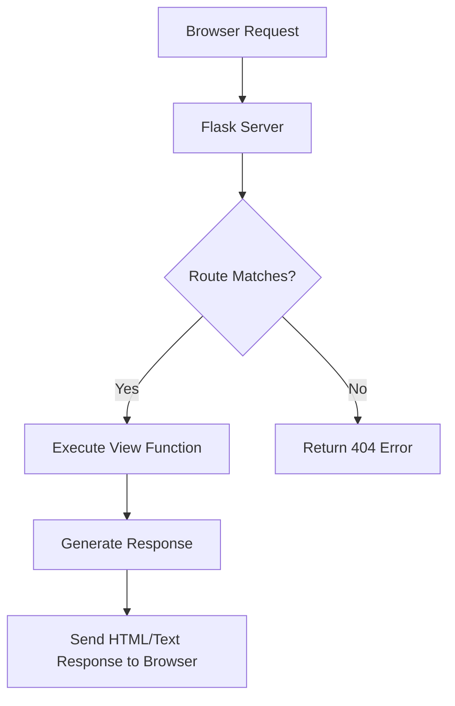

#### [[A - Table of Content]]
---
## 1. Concept  

- **App Routing** means mapping URLs to specific functions that handle the logic for those URLs.
- Modern web frameworks use meaningful URLs to make navigation simple and memorable.
- Use the [`route()`](https://flask.palletsprojects.com/en/stable/api/#flask.Flask.route) **decorator** to bind a function to a URL.

```python
@app.route('/')  # URL: http://127.0.0.1:5000/
def index():     # Function handling the logic
    return 'Index Page'

@app.route('/hello')  # URL: http://127.0.0.1:5000/hello
def hello():
    return 'Hello, World'
```

### 1.1 Routing Lifecycle Diagram



##  2. Variable Rules
-  Variable parts of a URL are marked with `<variable_name>`.
- Flask passes these values to the function as keyword arguments.
- Optionally, specify a **converter type** using `<converter:variable_name>`.
 #### Example
```python
from flask import Flask
from markupsafe import escape

app = Flask(__name__)
app.app_context().push()

@app.route('/user/<username>')
def show_user_profile(username): # show User <username>
    return f'User {escape(username)}' # Security: escape() prevents HTML injection

@app.route('/post/<int:post_id>')
def show_post(post_id):  # show the post with the given id, the id is an integer
    return f'Post {post_id}'
    
@app.route('/path/<path:subpath>')
def show_subpath(subpath):   # show the subpath after /path/
    return f'Subpath {escape(subpath)}' # it prevents HTML injection.
```
 - Save as **`test.py`**
 - Run using Flask CLI:
 ```bash
 flask --app test run
 ```
 - You will see
 ``` bash
 * Serving Flask app 'test'
 * Debug mode: off
WARNING: This is a development server. Do not use it in a production deployment. Use a production WSGI server instead.
 * Running on http://127.0.0.1:5000
Press CTRL+C to quit
 ```
 - `*Running on http://127.0.0.1:5000` :  Shows the local address and port where the app is running. Open this URL in a browser to access your app.

| Route                  | Example URL                                  | Expected Output           |
| ---------------------- | -------------------------------------------- | ------------------------- |
| `/user/<username>`     | `http://127.0.0.1:5000/user/Anshul`          | `User Anshul`             |
| `/post/<int:post_id>`  | `http://127.0.0.1:5000/post/10`              | `Post 10`                 |
| `/path/<path:subpath>` | `http://127.0.0.1:5000/path/folder1/folder2` | `Subpath folder1/folder2` |
###  2.1 Converter types:

| Data Type | desc                                       |
| --------- | ------------------------------------------ |
| `string`  | (default) accepts any text without a slash |
| `int`     | accepts positive integers                  |
| `float`   | accepts positive floating point values     |
| `path`    | like `string` but also accepts slashes     |
| `uuid`    | accepts UUID strings                       |

## 3. Unique URLs / Redirection Behavior
- Two routes can behave differently based on a trailing slash:
```python
@app.route('/projects/')
def projects():
    return 'The project page'

@app.route('/about')
def about():
    return 'The about page'
```
- `/projects` → Redirects to `/projects/` ✅
- `/about/` → Returns **404 Not Found** ❌
 **Why?**  
- Flask treats `/projects/` like a folder (redirects to canonical form)  
- and `/about` like a file (unique URL, no redirect).
## 4. URL Building with `url_for()`
- `url_for()` builds URLs dynamically, avoiding hardcoded paths.
- Handles variable parts automatically.
- Escapes special characters (like spaces).   
- Always generates absolute URLs.
- For example, here we use the [`test_request_context()`](https://flask.palletsprojects.com/en/stable/api/#flask.Flask.test_request_context "flask.Flask.test_request_context") method to try out [`url_for()`](https://flask.palletsprojects.com/en/stable/api/#flask.url_for "flask.url_for"). 
- `test_request_context()` tells Flask to behave as though it’s handling a request even while we use a Python shell.
```python
from flask import url_for

@app.route('/')
def index():
    return 'index'

@app.route('/login')
def login():
    return 'login'

@app.route('/user/<username>')
def profile(username):
    return f'{username}\'s profile'

with app.test_request_context():
    print(url_for('index'))
    print(url_for('login'))
    print(url_for('login', next='/'))
    print(url_for('profile', username='John Doe'))
```
-  Output
```
/
/login
/login?next=/
/user/John%20Doe
```

## 5. Summary 

| Concept             | Description                                  |
| ------------------- | -------------------------------------------- |
| **Routing**         | Maps URLs to view functions                  |
| **Variable Rules**  | Capture dynamic data from URLs               |
| **Type Converters** | Restrict data types (int, float, path, uuid) |
| **Redirection**     | Ensures consistent canonical URLs            |
| **url_for()**       | Dynamically builds and resolves URLs         |
| **escape()**        | Prevents XSS by escaping user input          |
