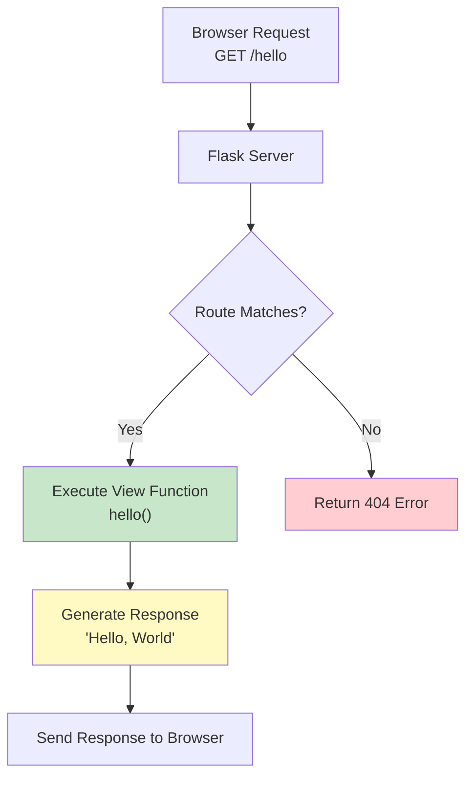

## [[A - Table of Content]]

# Flask Routing

## 1. What is Routing?

**Routing** maps URLs to specific functions that handle the logic for those URLs. Modern web frameworks use meaningful URLs to make navigation simple and memorable.

### Key Concepts

- Routes connect URLs to Python functions (called **view functions**)
- Use the `@app.route()` **decorator** to bind a function to a URL
- When a user visits a URL, Flask finds the matching route and executes its function

### Basic Example

```python
from flask import Flask

app = Flask(__name__)

@app.route('/')  # URL: http://127.0.0.1:5000/
def index():
    return 'Index Page'

@app.route('/hello')  # URL: http://127.0.0.1:5000/hello
def hello():
    return 'Hello, World'
```

### Routing Lifecycle



---

## 2. Variable Rules (Dynamic URLs)

Add **variable parts** to URLs using `<variable_name>`. Flask passes these values to your function as arguments.
<!--SR:!2025-11-18,4,270-->

### Basic Variable Rules

```python
from flask import Flask
from markupsafe import escape

app = Flask(__name__)

@app.route('/user/<username>')
def show_user_profile(username):
    # escape() prevents XSS by converting <script> to &lt;script&gt;
    return f'User {escape(username)}'

@app.route('/post/<int:post_id>')
def show_post(post_id):
    # post_id is automatically converted to an integer
    return f'Post {post_id}'

@app.route('/path/<path:subpath>')
def show_subpath(subpath):
    # path accepts slashes (for file paths)
    return f'Subpath {escape(subpath)}'
```

### Running the Application

**Save as `app.py` and run:**

```bash
flask --app app run
```

**Output:**

```
 * Serving Flask app 'app'
 * Debug mode: off
 * Running on http://127.0.0.1:5000
Press CTRL+C to quit
```

### Testing Routes

|Route|Example URL|Output|
|---|---|---|
|`/user/<username>`|`http://127.0.0.1:5000/user/Anshul`|`User Anshul`|
|`/post/<int:post_id>`|`http://127.0.0.1:5000/post/10`|`Post 10`|
|`/path/<path:subpath>`|`http://127.0.0.1:5000/path/folder1/folder2`|`Subpath folder1/folder2`|

---

## 3. URL Converters

Converters validate and convert URL parameters to specific Python types.

### Available Converters

|Converter|Pattern|Accepts|Rejects|Example|
|---|---|---|---|---|
|`string` (default)|`<name>`|Any text without `/`|Text with slashes|`john`, `hello-world`|
|`int`|`<int:id>`|Positive integers|Negative, floats, text|`42`, `123`|
|`float`|`<float:price>`|Positive floats|Negative, text|`9.99`, `42.0`|
|`path`|`<path:file>`|Any text (includes `/`)|Nothing|`docs/file.pdf`|
|`uuid`|`<uuid:id>`|Valid UUID strings|Invalid UUIDs|`550e8400-e29b-41d4-a716-446655440000`|

### Practical Examples

```python
@app.route('/product/<int:product_id>')
def product(product_id):
    # product_id is guaranteed to be an integer
    # /product/abc will return 404, not reach this function
    return f'Product ID: {product_id}'

@app.route('/price/<float:amount>')
def price(amount):
    # amount is a float
    return f'Price: ${amount:.2f}'

@app.route('/download/<path:filepath>')
def download(filepath):
    # filepath can contain slashes
    return f'Downloading: {filepath}'

@app.route('/item/<uuid:item_id>')
def item(item_id):
    # item_id is a UUID object
    return f'Item UUID: {item_id}'
```

### Security Note: Why Use `escape()`?

```python
from markupsafe import escape

# ✅ SAFE: Prevents XSS attacks
@app.route('/user/<username>')
def safe_user(username):
    return f'User {escape(username)}'
    # Input: <script>alert('XSS')</script>
    # Output: &lt;script&gt;alert('XSS')&lt;/script&gt;

# ❌ UNSAFE: Vulnerable to XSS
@app.route('/user/<username>')
def unsafe_user(username):
    return f'User {username}'
    # Input: <script>alert('XSS')</script>
    # Output: Executes JavaScript! 🚨
```

---

## 4. Trailing Slash Behavior

Flask treats URLs with and without trailing slashes differently, mimicking file system behavior.

### Example Routes

```python
@app.route('/projects/')  # Note the trailing slash
def projects():
    return 'The projects page'

@app.route('/about')  # No trailing slash
def about():
    return 'The about page'
```

### Behavior Table

|URL Accessed|Route Defined|Result|Explanation|
|---|---|---|---|
|`/projects`|`/projects/`|✅ Redirects to `/projects/` (301)|Treated like a directory|
|`/projects/`|`/projects/`|✅ Works normally|Canonical URL|
|`/about`|`/about`|✅ Works normally|Treated like a file|
|`/about/`|`/about`|❌ 404 Not Found|Different URL|

### Why This Design?

```
File System Analogy:
/projects/     ← Directory (folder)
               → Can be accessed with or without /
               
/about         ← File
               → Exact name required
```

**Best Practice:** Be consistent throughout your application:

- **Either** always use trailing slashes: `/users/`, `/posts/`
- **Or** never use them: `/users`, `/posts`

---

## 5. URL Building with `url_for()`

`url_for()` dynamically generates URLs, avoiding hardcoded paths and making your app maintainable.

### Why Use `url_for()`?

**❌ Bad (Hardcoded URLs):**

```python
@app.route('/')
def index():
    return '<a href="/login">Login</a>'  
    # Problems:
    # - Breaks if route changes
    # - Can't handle parameters easily
    # - No escaping of special characters
```

**✅ Good (Dynamic URLs):**

```python
from flask import url_for

@app.route('/')
def index():
    login_url = url_for('login')
    return f'<a href="{login_url}">Login</a>'
    # Benefits:
    # - Automatically updates if route changes
    # - Handles parameters safely
    # - Escapes special characters
```

### Key Benefits

|Benefit|Description|
|---|---|
|**Maintainable**|Change route once, works everywhere|
|**Safe**|Auto-escapes special characters (`John Doe` → `John%20Doe`)|
|**Flexible**|Easy to add query parameters|
|**Absolute URLs**|Can generate full URLs for emails/redirects|
<!--SR:!2000-01-01,1,250!2000-01-01,1,250!2000-01-01,1,250!2025-11-18,4,270-->

### Basic Examples

```python
from flask import Flask, url_for

app = Flask(__name__)

@app.route('/')
def index():
    return 'index'

@app.route('/login')
def login():
    return 'login'

@app.route('/user/<username>')
def profile(username):
    return f'{username}\'s profile'

# Test URL generation
with app.test_request_context():
    print(url_for('index'))                           # /
    print(url_for('login'))                           # /login
    print(url_for('login', next='/'))                 # /login?next=/
    print(url_for('profile', username='John Doe'))    # /user/John%20Doe
    print(url_for('profile', username='alice', page=2))  # /user/alice?page=2
```

**Output:**

```
/
/login
/login?next=/
/user/John%20Doe
/user/alice?page=2
```

### Using `url_for()` in Templates

```html
<!-- templates/index.html -->
<!DOCTYPE html>
<html>
<head>
    <!-- Static files -->
    <link rel="stylesheet" href="{{ url_for('static', filename='css/style.css') }}">
</head>
<body>
    <!-- Internal links -->
    <a href="{{ url_for('login') }}">Login</a>
    <a href="{{ url_for('profile', username='john') }}">John's Profile</a>
    
    <!-- With query parameters -->
    <a href="{{ url_for('search', q='flask', page=1) }}">Search</a>
    
    <!-- Static images -->
    
</body>
</html>
```

### Advanced: External URLs

```python
# Generate full URL (with domain)
with app.test_request_context():
    print(url_for('profile', username='john', _external=True))
    # Output: http://127.0.0.1:5000/user/john
    
    # Useful for:
    # - Email links
    # - API responses
    # - Redirects to external sites
```

---

## 6. HTTP Methods

By default, routes only respond to `GET` requests. Use the `methods` parameter to handle other HTTP methods.

### Basic HTTP Methods

```python
from flask import request

@app.route('/login', methods=['GET', 'POST'])
def login():
    if request.method == 'POST':
        # Handle form submission
        username = request.form.get('username')
        return f'Logging in as {username}...'
    else:
        # Show login form
        return '''
            <form method="post">
                <input name="username" type="text">
                <input type="submit" value="Login">
            </form>
        '''

@app.route('/data', methods=['GET'])
def get_data():
    return {'data': 'value'}

@app.route('/api/user', methods=['POST'])
def create_user():
    return {'message': 'User created'}, 201
```

### Common HTTP Methods

|Method|Purpose|Idempotent?|Example Use Case|
|---|---|---|---|
|`GET`|Retrieve data|✅ Yes|Display page, fetch API data|
|`POST`|Create resource|❌ No|Submit form, create user|
|`PUT`|Replace resource|✅ Yes|Update entire user profile|
|`PATCH`|Partial update|❌ No|Update user email only|
|`DELETE`|Remove resource|✅ Yes|Delete user account|

**Idempotent:** Calling multiple times has the same effect as calling once.

### RESTful API Example

```python
@app.route('/api/users', methods=['GET'])
def list_users():
    return {'users': ['alice', 'bob']}

@app.route('/api/users', methods=['POST'])
def create_user():
    return {'message': 'User created'}, 201

@app.route('/api/users/<int:user_id>', methods=['GET'])
def get_user(user_id):
    return {'user_id': user_id, 'name': 'Alice'}

@app.route('/api/users/<int:user_id>', methods=['PUT'])
def update_user(user_id):
    return {'message': f'User {user_id} updated'}

@app.route('/api/users/<int:user_id>', methods=['DELETE'])
def delete_user(user_id):
    return {'message': f'User {user_id} deleted'}
```

---

## 7. Error Handling

Handle errors gracefully with custom error pages and the `abort()` function.

### Custom Error Pages

```python
from flask import render_template

@app.errorhandler(404)
def page_not_found(error):
    return render_template('404.html'), 404

@app.errorhandler(500)
def internal_error(error):
    return render_template('500.html'), 500

@app.errorhandler(403)
def forbidden(error):
    return 'Access forbidden', 403
```

### Using `abort()`

Manually trigger HTTP errors:

```python
from flask import abort

@app.route('/user/<int:user_id>')
def show_user(user_id):
    if user_id > 1000:
        abort(404)  # User doesn't exist
    if user_id == 0:
        abort(400)  # Bad request
    return f'User {user_id}'

@app.route('/admin')
def admin():
    if not user_is_admin():
        abort(403)  # Forbidden
    return 'Admin panel'
```

### Common HTTP Status Codes

|Code|Meaning|When to Use|
|---|---|---|
|200|OK|Successful request|
|201|Created|Resource successfully created|
|400|Bad Request|Invalid input from client|
|401|Unauthorized|Login required|
|403|Forbidden|Logged in but no permission|
|404|Not Found|Resource doesn't exist|
|500|Internal Server Error|Server-side error|

---

## 8. Interview Questions & Answers

### Q1: What is routing in Flask?

**Answer:** Routing is the mechanism that maps URLs to Python functions (view functions). When a user visits a URL, Flask matches it against registered routes and executes the corresponding function. It's defined using the `@app.route()` decorator.

### Q2: Explain the difference between `/about` and `/about/` in Flask.

**Answer:**

- `/about/` (with trailing slash) - Treated like a directory. Accessing `/about` will redirect to `/about/` (HTTP 301)
- `/about` (without trailing slash) - Treated like a file. Accessing `/about/` will return 404 Not Found

This mimics file system behavior where directories can be accessed with or without trailing slashes, but files require exact names.

### Q3: What are URL converters and why are they important?

**Answer:** URL converters validate and convert URL parameters to specific Python types:

- `<int:id>` - Only accepts positive integers
- `<float:price>` - Accepts floating-point numbers
- `<path:file>` - Accepts paths with slashes
- `<uuid:id>` - Validates UUID format

**Benefits:**

- Automatic type validation (invalid inputs return 404)
- Type safety in view functions
- Cleaner code (no manual type conversion needed)

### Q4: Why should you use `url_for()` instead of hardcoded URLs?

**Answer:**

1. **Maintainability** - If route changes, all URLs update automatically
2. **Safety** - Auto-escapes special characters (spaces, etc.)
3. **Flexibility** - Easy to add query parameters
4. **Consistency** - Handles URL prefixes and application context
5. **Testability** - Can generate URLs without running server

Example:

```python
# Bad: Hardcoded
return '<a href="/user/john">Profile</a>'

# Good: Dynamic
return f'<a href="{url_for("profile", username="john")}">Profile</a>'
```

### Q5: How do you handle multiple HTTP methods on a single route?

**Answer:**

```python
from flask import request

@app.route('/api/user', methods=['GET', 'POST'])
def user_api():
    if request.method == 'POST':
        return create_user()
    return get_users()
```

You can check `request.method` to determine which HTTP method was used and handle accordingly.

### Q6: What's the purpose of `escape()` in Flask routing?

**Answer:** `escape()` from MarkupSafe prevents XSS (Cross-Site Scripting) attacks by converting HTML special characters:

- `<` becomes `&lt;`
- `>` becomes `&gt;`
- `"` becomes `&quot;`

This prevents malicious users from injecting JavaScript:

```python
# Safe: <script> is displayed as text
return f'User {escape(username)}'

# Unsafe: <script> executes!
return f'User {username}'
```

### Q7: What happens when Flask can't find a matching route?

**Answer:** Flask returns a `404 Not Found` error. You can customize this behavior using:

```python
@app.errorhandler(404)
def page_not_found(error):
    return render_template('404.html'), 404
```

### Q8: Explain the difference between `GET` and `POST` requests.

**Answer:**

- **GET**: Retrieves data, parameters in URL, idempotent (safe to repeat), cacheable
    - Example: Loading a webpage, searching
- **POST**: Submits data, parameters in request body, not idempotent, not cacheable
    - Example: Form submission, file upload, creating resources

```python
@app.route('/form', methods=['GET', 'POST'])
def form():
    if request.method == 'POST':
        return process_form()  # Handle submission
    return show_form()  # Display form
```

### Q9: How do you pass variables to a route?

**Answer:** Use angle brackets in the route definition:

```python
@app.route('/user/<username>')
def profile(username):
    return f'Profile: {username}'

# With type converter
@app.route('/post/<int:post_id>')
def post(post_id):  # post_id is an integer
    return f'Post {post_id}'
```

### Q10: What is `test_request_context()` used for?

**Answer:** `test_request_context()` creates a fake request context for testing URL generation outside of actual requests:

```python
with app.test_request_context():
    print(url_for('index'))  # Works without a real HTTP request
```

It's useful for:

- Testing `url_for()` in unit tests
- Debugging route generation
- Working with Flask in Python shell

---

## 9. Complete Example

```python
from flask import Flask, render_template, request, url_for, abort
from markupsafe import escape

app = Flask(__name__)

# Basic routes
@app.route('/')
def index():
    return '''
        <h1>Welcome</h1>
        <a href="{}">Login</a><br>
        <a href="{}">User Profile</a><br>
        <a href="{}">Post 42</a>
    '''.format(
        url_for('login'),
        url_for('profile', username='john'),
        url_for('post', post_id=42)
    )

# Variable rules with converters
@app.route('/user/<username>')
def profile(username):
    return f'<h1>User: {escape(username)}</h1>'

@app.route('/post/<int:post_id>')
def post(post_id):
    if post_id > 100:
        abort(404)
    return f'<h1>Post {post_id}</h1>'

@app.route('/files/<path:filepath>')
def files(filepath):
    return f'<h1>File: {escape(filepath)}</h1>'

# HTTP methods
@app.route('/login', methods=['GET', 'POST'])
def login():
    if request.method == 'POST':
        username = request.form.get('username')
        return f'<h1>Welcome, {escape(username)}!</h1>'
    return '''
        <form method="post">
            <input name="username" placeholder="Username">
            <button>Login</button>
        </form>
    '''

# Error handling
@app.errorhandler(404)
def not_found(error):
    return '<h1>404 - Page Not Found</h1>', 404

if __name__ == '__main__':
    app.run(debug=True)
```

**Run with:**

```bash
python app.py
# or
flask --app app run
```

---

## 10. Summary

|Concept|Description|Example|
|---|---|---|
|**Routing**|Maps URLs to view functions|`@app.route('/home')`|
|**Variable Rules**|Capture dynamic URL parts|`<username>`, `<int:id>`|
|**Converters**|Type validation in URLs|`int`, `float`, `path`, `uuid`|
|**Trailing Slash**|`/projects/` redirects, `/about` doesn't|Folder vs file behavior|
|**url_for()**|Dynamic URL generation|`url_for('profile', username='john')`|
|**escape()**|XSS prevention|Converts `<script>` to `&lt;script&gt;`|
|**HTTP Methods**|Handle GET, POST, PUT, DELETE|`methods=['GET', 'POST']`|
|**Error Handling**|Custom error pages|`@app.errorhandler(404)`|
|**abort()**|Manually trigger errors|`abort(404)`|
<!--SR:!2000-01-01,1,250!2000-01-01,1,250!2025-11-18,4,270!2000-01-01,1,250!2000-01-01,1,250!2000-01-01,1,250!2000-01-01,1,250!2000-01-01,1,250!2000-01-01,1,250-->

---

## 11. Best Practices

### ✅ DO:

- Use `url_for()` for all internal links
- Always use `escape()` for user input in responses
- Use appropriate HTTP methods (GET for reading, POST for creating)
- Add type converters to routes for validation
- Create custom error pages for better UX
- Be consistent with trailing slashes

### ❌ DON'T:

- Hardcode URLs in templates or code
- Return raw user input without escaping
- Use GET for operations that modify data
- Ignore HTTP status codes
- Mix trailing slash conventions
- Forget to validate URL parameters

---

**Last Updated**: November 2025  
**Status**: Interview Ready ✅