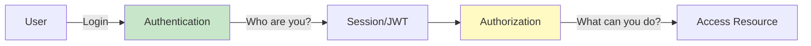
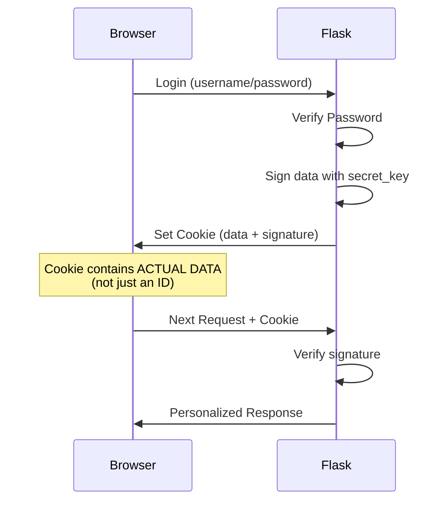
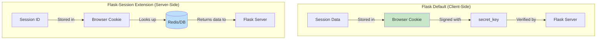
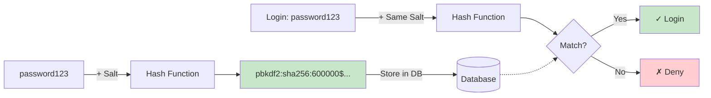
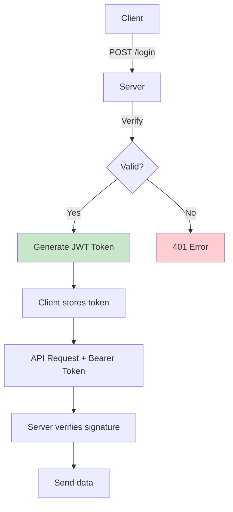
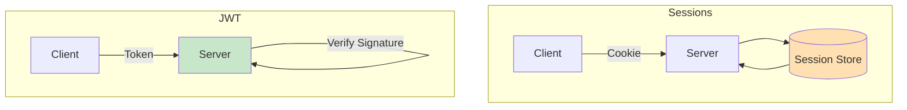
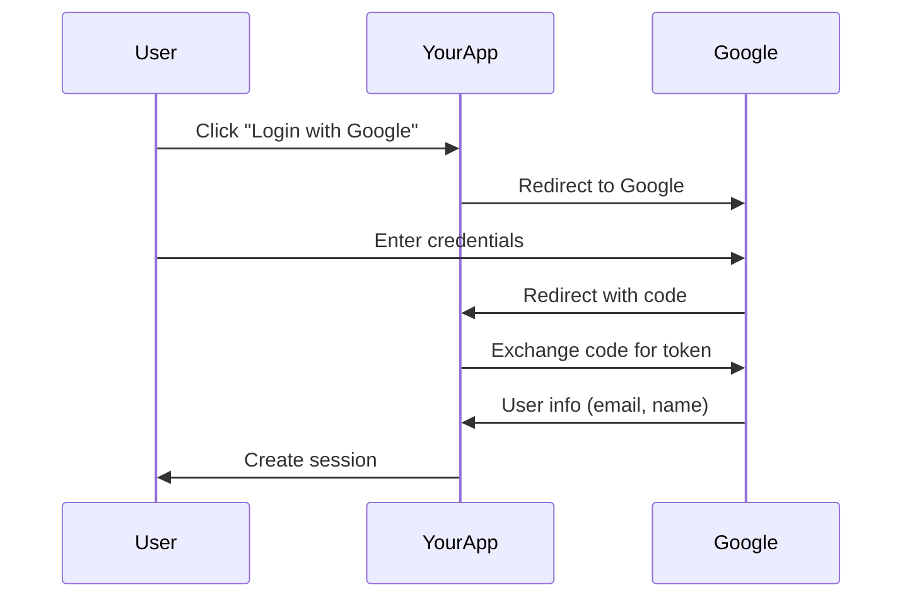
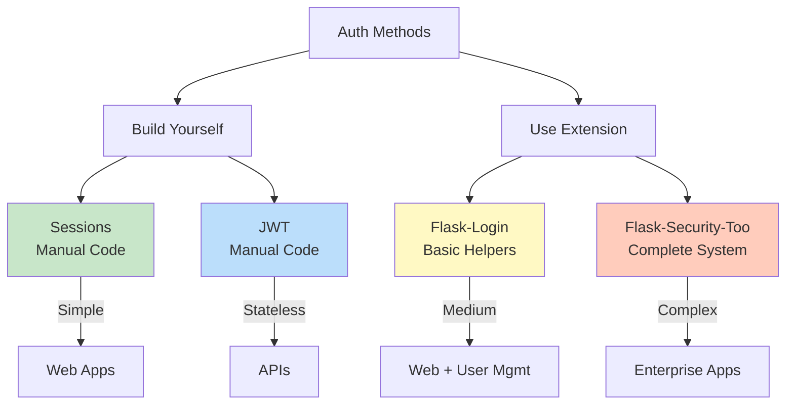
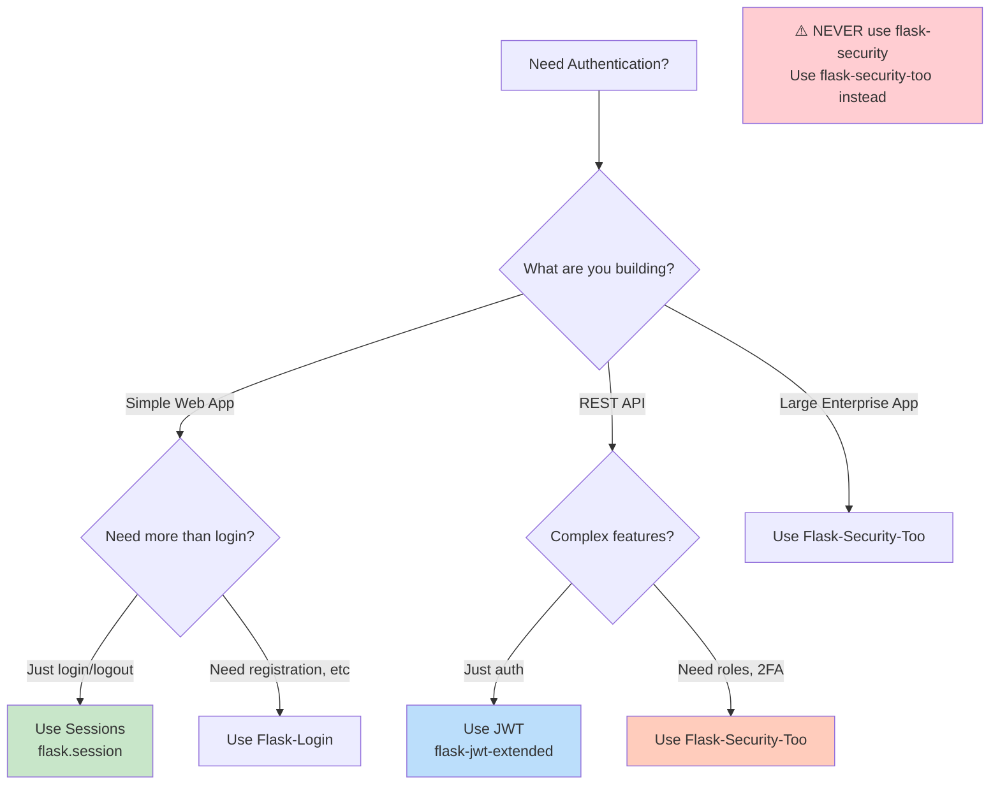

# Flask Authentication - Interview Ready Notes

## 1. Core Concepts



|Term|Meaning|
|---|---|
|**Authentication**|Verify identity (login)|
|**Authorization**|Check permissions (admin?)|
|**Session**|Store user state across requests|
|**Hashing**|One-way encryption for passwords|

---

## 2. Sessions (Flask Default)

### ⚠️ Important: Flask Sessions are CLIENT-SIDE!



**Key Concept:**

```python
# Flask DEFAULT sessions
session['user_id'] = 123
# ↓ Cookie sent to browser contains:
# {'user_id': 123}.signature
# Data is IN the cookie (client-side), just signed!
```

### Quick Example

```python
from flask import Flask, session, redirect

app = Flask(__name__)
app.secret_key = 'your-secret-key'  # For signing cookies

@app.route('/login', methods=['POST'])
def login():
    session['user_id'] = 123  # Stored IN cookie (client-side)
    return redirect('/dashboard')

@app.route('/dashboard')
def dashboard():
    if 'user_id' not in session:  # Read from cookie
        return redirect('/login')
    return f"Welcome user {session['user_id']}"

@app.route('/logout')
def logout():
    session.clear()  # Delete cookie
    return redirect('/login')
```

**Key Methods:**

```python
session['key'] = value       # Store in cookie
session.get('key')           # Get from cookie
'key' in session             # Check cookie
session.clear()              # Clear cookie
```

### Client-Side vs Server-Side Sessions



|Type|Storage|Pros|Cons|
|---|---|---|---|
|**Client-Side** (Flask default)|Data in signed cookie|✅ No server storage<br/>✅ Scales horizontally<br/>✅ Simple setup|❌ 4KB size limit<br/>❌ Data visible to client<br/>❌ Can't revoke individual sessions|
|**Server-Side** (Flask-Session)|Session ID in cookie, data in Redis/DB|✅ Unlimited size<br/>✅ More secure<br/>✅ Can revoke sessions|❌ Needs Redis/DB<br/>❌ More complex<br/>❌ Single point of failure|

**Flask Default = Client-Side!** Most Flask apps use this.

---

## 3. Password Hashing



### Usage

```python
from werkzeug.security import generate_password_hash, check_password_hash

# Registration
hash = generate_password_hash('password123')
# Save 'hash' to database

# Login
if check_password_hash(stored_hash, user_input):
    session['user_id'] = user.id
```

**Why?**

- ❌ Plain: `password123` → If DB leaked, exposed!
- ✅ Hashed: `pbkdf2:sha256:600000$...` → Useless to attacker

---

## 4. Complete Login App

**File: `app.py`**

```python
# ==============================================================================
# FLASK AUTHENTICATION - QUICK REVISION
# ==============================================================================

from flask import Flask, request, redirect, session, flash
from werkzeug.security import generate_password_hash, check_password_hash
import sqlite3

app = Flask(__name__)
app.secret_key = 'change-me-in-production'  # Signs session cookies

# ------------------------------------------------------------------------------
# DATABASE SETUP
# ------------------------------------------------------------------------------
def get_db():
    # Connect to SQLite, return connection
    conn = sqlite3.connect('users.db')
    conn.row_factory = sqlite3.Row  # Access columns by name
    return conn

def init_db():
    # Create users table + default admin user
    conn = get_db()
    conn.execute('''CREATE TABLE IF NOT EXISTS users (
        id INTEGER PRIMARY KEY,
        username TEXT UNIQUE,
        password_hash TEXT
    )''')
    conn.execute('INSERT OR IGNORE INTO users VALUES (1, ?, ?)',
                 ('admin', generate_password_hash('admin123')))
    conn.commit()
    conn.close()

# ------------------------------------------------------------------------------
# ROUTES
# ------------------------------------------------------------------------------

@app.route('/register', methods=['GET', 'POST'])
def register():
    """
    • GET: Show registration form
    • POST: Hash password → Save to DB → Redirect to login
    • If username exists: Show error
    """
    if request.method == 'POST':
        username = request.form['username']
        password = request.form['password']
        
        conn = get_db()
        try:
            # Hash password before storing
            conn.execute('INSERT INTO users (username, password_hash) VALUES (?, ?)',
                        (username, generate_password_hash(password)))
            conn.commit()
            flash('Registered! Please login.')
            return redirect('/login')
        except sqlite3.IntegrityError:
            flash('Username exists!')
        finally:
            conn.close()
    
    return '''
        <h2>Register</h2>
        <form method="post">
            Username: <input name="username" required><br>
            Password: <input name="password" type="password" required><br>
            <button>Register</button>
        </form>
        <a href="/login">Login</a>
    '''


@app.route('/login', methods=['GET', 'POST'])
def login():
    """
    • GET: Show login form
    • POST: Verify password → Create session → Redirect to dashboard
    • If invalid: Show error
    """
    if request.method == 'POST':
        username = request.form['username']
        password = request.form['password']
        
        # Look up user
        conn = get_db()
        user = conn.execute('SELECT * FROM users WHERE username = ?', 
                           (username,)).fetchone()
        conn.close()
        
        # Verify password
        if user and check_password_hash(user['password_hash'], password):
            session.clear()  # Prevent session fixation
            session['user_id'] = user['id']        # Store in cookie
            session['username'] = user['username']
            return redirect('/dashboard')
        
        flash('Invalid credentials!')
    
    return '''
        <h2>Login</h2>
        <form method="post">
            Username: <input name="username" required><br>
            Password: <input name="password" type="password" required><br>
            <button>Login</button>
        </form>
        <a href="/register">Register</a>
    '''


@app.route('/dashboard')
def dashboard():
    """
    • Protected route: Check if logged in
    • If not: Redirect to login
    • If yes: Show welcome message
    """
    if 'user_id' not in session:
        return redirect('/login')
    return f'''
        <h2>Welcome {session["username"]}!</h2>
        <a href="/logout">Logout</a>
    '''


@app.route('/logout')
def logout():
    """
    • Clear session cookie → Redirect to login
    """
    session.clear()
    flash('Logged out!')
    return redirect('/login')


@app.route('/')
def index():
    return '<a href="/login">Login</a> | <a href="/register">Register</a>'


if __name__ == '__main__':
    init_db()  # Create DB on first run
    app.run(debug=True)


# ==============================================================================
# QUICK FLOW
# ==============================================================================
"""
1. REGISTER
   password → generate_password_hash() → Store hash in DB

2. LOGIN
   Get user → check_password_hash(stored, input) → session['user_id'] = id

3. DASHBOARD
   Check session['user_id'] → If exists: show page, else: redirect login

4. LOGOUT
   session.clear() → Delete cookie
"""


# ==============================================================================
# KEY CONCEPTS
# ==============================================================================
"""
• generate_password_hash('pass')  → 'pbkdf2:sha256:600000$...' (one-way)
• check_password_hash(hash, 'pass') → True/False
• session['key'] = value           → Stored in signed cookie (client-side)
• session.clear()                  → Delete cookie (logout)
• 'user_id' in session             → Check if logged in
"""


# ==============================================================================
# SECURITY
# ==============================================================================
"""
✓ Password hashing (PBKDF2 + salt)
✓ Signed cookies (secret_key prevents tampering)
✓ Session fixation prevention (session.clear() before login)
✓ SQL injection prevention (parameterized queries with ?)
✓ Unique usernames (UNIQUE constraint)
"""


# ==============================================================================
# TEST IT
# ==============================================================================
"""
$ python app.py
→ http://localhost:5000
→ Default login: admin / admin123
"""
```


---

## 5. Protecting Routes

```python
from functools import wraps

def login_required(f):
    @wraps(f)
    def decorated(*args, **kwargs):
        if 'user_id' not in session:
            return redirect('/login')
        return f(*args, **kwargs)
    return decorated

@app.route('/admin')
@login_required
def admin():
    return "Admin panel"
```

---

## 6. JWT (For APIs)



### JWT Structure

```
header.payload.signature
eyJhbGc.eyJ1c2Vy.signature_hash
```

**Decoded (anyone can decode with base64!):**

```json
{"alg": "HS256"}              // Header
{"user_id": 123, "exp": ...}  // Payload ⚠️ NOT ENCRYPTED!
signature_hash                // Signature (prevents tampering)
```

**⚠️ CRITICAL: JWT Payload is NOT Encrypted!**

```python
# ❌ NEVER store in JWT:
{'password': 'secret123'}      # Anyone can decode!
{'api_key': 'sk-123'}          # Visible to everyone!
{'ssn': '123-45-6789'}         # Not secure!

# ✅ ONLY store:
{'user_id': 123}               # Public identifier
{'role': 'admin'}              # Non-sensitive data
{'exp': 1234567890}            # Expiration time
```

**JWT = Signed, NOT Encrypted**

- **Signature** prevents tampering (can't modify without secret)
- **Payload** is readable by anyone (base64 decode)
- Think of it like a signed letter in a transparent envelope

### Implementation

```python
from flask_jwt_extended import JWTManager, create_access_token, jwt_required, get_jwt_identity

app.config['JWT_SECRET_KEY'] = 'secret'
jwt = JWTManager(app)

@app.route('/api/login', methods=['POST'])
def api_login():
    username = request.json['username']
    password = request.json['password']
    
    # Verify credentials...
    if valid:
        token = create_access_token(identity=user_id)
        return {'token': token}
    return {'error': 'Invalid'}, 401

@app.route('/api/dashboard')
@jwt_required()
def api_dashboard():
    user_id = get_jwt_identity()
    return {'user_id': user_id}
```

**Client Usage:**

```javascript
// Login
fetch('/api/login', {
    method: 'POST',
    body: JSON.stringify({username: 'alice', password: 'pass'}),
    headers: {'Content-Type': 'application/json'}
})
.then(r => r.json())
.then(data => localStorage.setItem('token', data.token));

// Use token
fetch('/api/dashboard', {
    headers: {'Authorization': `Bearer ${localStorage.getItem('token')}`}
});
```

---

## 7. Sessions vs JWT



|Feature|Sessions|JWT|
|---|---|---|
|**Storage**|Server|Client|
|**State**|Stateful|Stateless|
|**Scale**|Needs sticky sessions|Easy horizontal scaling|
|**Revoke**|Easy (delete session)|Hard (need blacklist)|
|**Size**|4KB cookie|Can be large|
|**Use Case**|Web apps|APIs, mobile|
<!--SR:!2000-01-01,1,250!2000-01-01,1,250!2000-01-01,1,250!2025-11-18,4,270!2000-01-01,1,250!2000-01-01,1,250-->

---

## 8. OAuth (Social Login)



### Example

```python
from authlib.integrations.flask_client import OAuth

oauth = OAuth(app)
google = oauth.register(
    name='google',
    client_id='YOUR_ID',
    client_secret='YOUR_SECRET',
    server_metadata_url='https://accounts.google.com/.well-known/openid-configuration',
    client_kwargs={'scope': 'openid email profile'}
)

@app.route('/login/google')
def google_login():
    return google.authorize_redirect(url_for('google_callback', _external=True))

@app.route('/callback/google')
def google_callback():
    token = google.authorize_access_token()
    user = token['userinfo']
    session['email'] = user['email']
    return redirect('/dashboard')
```

---

## 9. Security Checklist

```python
# ✅ Strong Secret Key
app.secret_key = os.urandom(32)

# ✅ Secure Cookies
app.config['SESSION_COOKIE_HTTPONLY'] = True  # No JS access
app.config['SESSION_COOKIE_SECURE'] = True    # HTTPS only
app.config['SESSION_COOKIE_SAMESITE'] = 'Lax' # CSRF protection

# ✅ Password Hashing
generate_password_hash(password)  # Auto-salted PBKDF2

# ✅ Prevent Session Fixation
session.clear() before login

# ✅ Rate Limiting
from flask_limiter import Limiter
limiter = Limiter(app, key_func=lambda: request.remote_addr)
@limiter.limit("5 per minute")

# ✅ CSRF Protection
from flask_wtf.csrf import CSRFProtect
csrf = CSRFProtect(app)
```

---

## 10. Interview Q&A

**Q: Authentication vs Authorization?**

> Auth**n** = Who are you? (Login)  
> Auth**z** = What can you do? (Permissions)

**Q: Why hash passwords?**

> One-way encryption + salt. If DB leaked, hashes are useless.

**Q: How do Flask sessions work?**

> Signed cookies stored on client. Server verifies signature each request.

**Q: Sessions vs JWT?**
<!--SR:!2025-11-18,4,270-->

> Sessions: Simple, secure, easy logout. For web apps.  
> JWT: Stateless, scales well. For APIs/mobile.

**Q: What's in a JWT token?**

> Header (algorithm), Payload (user_id, expiry), Signature (prevents tampering).  
> ⚠️ Payload is readable - don't store secrets!

**Q: How to revoke JWT?**

> Use short expiry (15min) + refresh tokens (7 days), or maintain blacklist in Redis.

**Q: Prevent brute force?**

> Rate limiting (5 attempts/min), account lockout, CAPTCHA, exponential backoff.

**Q: What's a salt?**

> Random data added before hashing. Same password → different hashes.

**Q: Session fixation?**

> Call `session.clear()` before login to prevent attacker pre-setting session ID.

---

## 11. Quick Reference

```python
# SESSION
session['user_id'] = 123
if 'user_id' in session:
    # logged in
session.clear()

# PASSWORD
hash = generate_password_hash('pass')
check_password_hash(hash, 'pass')  # True/False

# DECORATOR
@login_required
def protected():
    return session['username']

# JWT
token = create_access_token(identity=user_id)
@jwt_required()
user = get_jwt_identity()

# FLASK-LOGIN
login_user(user)
logout_user()
current_user.username
```

---

## 12. Flask-Security vs Flask-Security-Too vs JWT vs Sessions

### Visual Comparison



### Detailed Comparison

|Feature|Sessions (Flask Default)|JWT|Flask-Security-Too|
|---|---|---|---|
|**What is it?**|Client-side signed cookies|Stateless tokens|Complete auth extension|
|**Data Storage**|In browser cookie (signed)|In browser (token)|Server-side (configurable)|
|**Server Storage**|None (stateless!)|None (stateless!)|Session store needed|
|**State**|Stateless (data in cookie)|Stateless (data in token)|Stateful|
|**Code Required**|Manual everything|Manual everything|Minimal (pre-built)|
|**Features**|Login/logout only|Login/logout only|Registration, email verify, password reset, 2FA, roles|
|**Complexity**|Simple|Medium|High (lots of config)|
|**Size Limit**|4KB per cookie|No limit (but sent every request)|No limit|
|**Scalability**|✅ Excellent (no server state)|✅ Excellent (no server state)|⚠️ Moderate (needs session store)|
|**Revocation**|❌ Hard (delete cookie client-side)|❌ Hard (need blacklist)|✅ Easy (server-side)|
|**Security**|✅ Data signed & httpOnly|⚠️ Data readable by client|✅ Configurable|
|**Use Case**|Simple web apps|APIs, microservices|Large enterprise apps|
|**Learning Curve**|Easy|Medium|Steep|
|**Package**|`flask` (built-in)|`flask-jwt-extended`|`flask-security-too`|
<!--SR:!2000-01-01,1,250!2000-01-01,1,250!2000-01-01,1,250!2000-01-01,1,250!2000-01-01,1,250!2000-01-01,1,250!2000-01-01,1,250!2000-01-01,1,250!2000-01-01,1,250!2000-01-01,1,250!2000-01-01,1,250!2000-01-01,1,250!2000-01-01,1,250!2025-11-18,4,270-->

---

### 1. Sessions (Flask Built-in)

**What:** Stores user data in signed cookies on client browser (NOT server!).

```python
from flask import session

# That's it - no extra packages!
session['user_id'] = 123  # Data stored IN cookie (client-side)
if 'user_id' in session:  # Read FROM cookie
    pass
session.clear()  # Delete cookie
```

**How it works:**
<!--SR:!2025-11-18,4,270-->

1. You set `session['user_id'] = 123`
2. Flask serializes data → signs with `secret_key` → sends as cookie
3. Browser stores cookie with actual data + signature
4. Next request: Flask verifies signature → reads data
5. **No database lookup needed!**

**Pros:**

- ✅ Built into Flask (no dependencies)
- ✅ Simple to understand
- ✅ Secure (signed, httpOnly)
- ✅ Scales horizontally (no server storage!)

**Cons:**

- ❌ 4KB cookie size limit
- ❌ Data visible to client (though signed)
- ❌ Can't revoke individual sessions easily
- ❌ Need to code everything yourself

**When:** Small to medium web apps, MVPs, learning Flask

**⚠️ Common Misconception:** Flask sessions are NOT stored on the server by default!

---

### 2. JWT (Flask-JWT-Extended)

**What:** Self-contained tokens containing user info, sent with each request.

```python
from flask_jwt_extended import create_access_token, jwt_required

# Generate token
token = create_access_token(identity=user_id)

# Protect routes
@app.route('/api/data')
@jwt_required()
def data():
    return {'data': 'secret'}
```

**How it works:**

1. User logs in → server creates JWT token
2. Token contains user_id, expiry (readable by anyone!)
3. Client stores token (localStorage/cookie)
4. Client sends token with every request: `Authorization: Bearer <token>`
5. Server verifies signature (no database needed!)

**Pros:**

- ✅ Stateless (no server storage)
- ✅ Perfect for APIs
- ✅ Scales horizontally easily
- ✅ Works across domains (CORS-friendly)
- ✅ Mobile-friendly

**Cons:**

- ❌ Hard to revoke tokens (need blacklist)
- ❌ Token sent with every request (bandwidth)
- ❌ **Payload is readable** (never store passwords/secrets!)
- ❌ Need to code registration, password reset, etc.
- ❌ XSS vulnerable if stored in localStorage

**When:** REST APIs, mobile apps, microservices, SPAs (React/Vue)
<!--SR:!2025-11-18,4,270-->

**⚠️ CRITICAL:** JWT payload is base64-encoded, NOT encrypted! Anyone can decode it.

---

### 3. Flask-Security-Too

**What:** Complete authentication system with EVERYTHING pre-built.

```python
from flask_security import Security, SQLAlchemyUserDatastore

# Setup (lots of config!)
user_datastore = SQLAlchemyUserDatastore(db, User, Role)
security = Security(app, user_datastore)

# Now you get for FREE:
# - Registration with email confirmation
# - Password reset via email
# - Two-factor authentication (2FA)
# - Role-based permissions
# - Account activation
# - Change password
# - Session management
```

**Pros:**

- ✅ Everything included (registration, email, 2FA, roles)
- ✅ Battle-tested and secure
- ✅ Saves development time
- ✅ Customizable templates

**Cons:**

- ❌ Heavy (many dependencies)
- ❌ Opinionated (must follow its patterns)
- ❌ Steep learning curve
- ❌ Overkill for simple apps
- ❌ Hard to customize deeply

**When:** Large enterprise apps, need full auth system quickly, have complex requirements (roles, 2FA, etc.)

---

### 4. Flask-Security vs Flask-Security-Too


||Flask-Security|Flask-Security-Too|
|---|---|---|
|**Status**|⚠️ Abandoned (last update 2017)|✅ Active (maintained fork)|
|**Use**|❌ Don't use|✅ Use this one|
|**Package**|`flask-security`|`flask-security-too`|

**Note:** Always use `flask-security-too` - it's the actively maintained version!


---

## Decision Tree



---

## Code Comparison

### Sessions (Manual)

```python
@app.route('/login', methods=['POST'])
def login():
    # You write ALL logic
    user = User.query.filter_by(username=username).first()
    if user and check_password_hash(user.password_hash, password):
        session['user_id'] = user.id
        return redirect('/dashboard')
    return 'Invalid credentials'

@app.route('/dashboard')
def dashboard():
    if 'user_id' not in session:  # You check manually
        return redirect('/login')
    return 'Dashboard'
```

### JWT (Manual)

```python
@app.route('/api/login', methods=['POST'])
def login():
    # You write ALL logic
    user = User.query.filter_by(username=username).first()
    if user and check_password_hash(user.password_hash, password):
        token = create_access_token(identity=user.id)
        return {'token': token}
    return {'error': 'Invalid'}, 401

@app.route('/api/dashboard')
@jwt_required()  # Extension handles this
def dashboard():
    user_id = get_jwt_identity()
    return {'data': 'secret'}
```

### Flask-Security-Too (Pre-built)

```python
from flask_security import Security, login_required, current_user

# Just setup
security = Security(app, user_datastore)

# Everything works automatically!
@app.route('/dashboard')
@login_required  # Extension handles everything
def dashboard():
    return f'Welcome {current_user.email}'

# You get these URLs for FREE:
# /login, /logout, /register, /reset, /confirm, /change
```

---

## Real Interview Answers

**Q: "Where are Flask sessions stored?"**

✅ **Correct answer:**
<!--SR:!2025-11-18,4,270-->

> "Flask sessions are stored CLIENT-SIDE in signed cookies by default. The cookie contains the actual data (like user_id), not just a session ID. Flask signs it with the secret_key to prevent tampering. This is different from server-side sessions where only an ID is in the cookie and data is in Redis or a database."

❌ **Wrong answer:** "Sessions are stored on the server"

---

**Q: "What auth method did you use in your project?"**

✅ **Good answer:**
<!--SR:!2025-11-18,4,270-->

> "I used Flask's built-in sessions because it's a traditional web app. Sessions are client-side signed cookies - simple, secure, and they scale horizontally since there's no server storage. I implemented password hashing with Werkzeug's PBKDF2 and added a login_required decorator for protected routes."

---

**Q: "When would you use JWT instead?"**

✅ **Good answer:**

> "JWT is better for REST APIs and mobile apps because it's stateless and works across domains. The tradeoff is the payload is readable by anyone (it's base64, not encrypted), so you can't store sensitive data. Also, revoking tokens requires a blacklist. For traditional web apps, signed cookies are simpler."

---

**Q: "Can you decode a JWT token?"**

✅ **Good answer:**

> "Yes! JWT is base64-encoded, NOT encrypted. Anyone can decode the payload and read the data. The signature only prevents tampering - it doesn't hide the content. That's why you should never store passwords, API keys, or sensitive data in JWT. Only store public identifiers like user_id and roles."

---

**Q: "What about Flask-Security?"**

✅ **Good answer:**

> "Flask-Security is abandoned since 2017. Flask-Security-Too is the maintained fork with all the features - email confirmation, 2FA, password reset, role management. It's great for large apps but heavy and opinionated. For simpler projects, I prefer building custom auth with Flask-Login for more control."

---

**Q: "How do Flask sessions scale?"**

✅ **Good answer:**

> "Flask's default sessions scale great horizontally because they're client-side signed cookies - no server storage or sticky sessions needed. Each request contains the data, so any server can handle it. The limitation is the 4KB cookie size. If you need server-side sessions with Redis, you'd use the Flask-Session extension."

---

**Q: "Flask-Security vs Flask-Security-Too?"**

✅ **Good answer:**

> "Flask-Security is abandoned since 2017. Flask-Security-Too is the maintained fork - always use that one. The 'Too' version has bug fixes, security updates, and active development."

---

**Q: "What's the difference between signing and encryption?"**

✅ **Good answer:**

> "Signing prevents tampering but doesn't hide data. Flask sessions and JWT are signed - you can read them, but can't modify without the secret key. Encryption hides data - you can't read it without the key. So Flask sessions and JWT payloads are readable, just tamper-proof."

---

## Method Comparison Table

|Method|When to Use|Library|
|---|---|---|
|**Sessions**|Traditional web apps|`flask.session` (built-in)|
|**JWT**|REST APIs, SPAs, mobile|`flask-jwt-extended`|
|**Flask-Login**|Web apps needing user helpers|`flask-login`|
|**Flask-Security-Too**|Enterprise apps (2FA, roles, email)|`flask-security-too`|
|**OAuth**|Social login (Google, GitHub)|`authlib`|

---

## Setup Commands

```bash
# Basic
pip install flask

# JWT
pip install flask-jwt-extended

# OAuth
pip install authlib

# User Management
pip install flask-login

# All-in-one
pip install flask-security-too

# Security extras
pip install flask-limiter flask-wtf flask-cors
```

---

**Last Updated**: November 2025
**Status**: Interview Ready ✅
