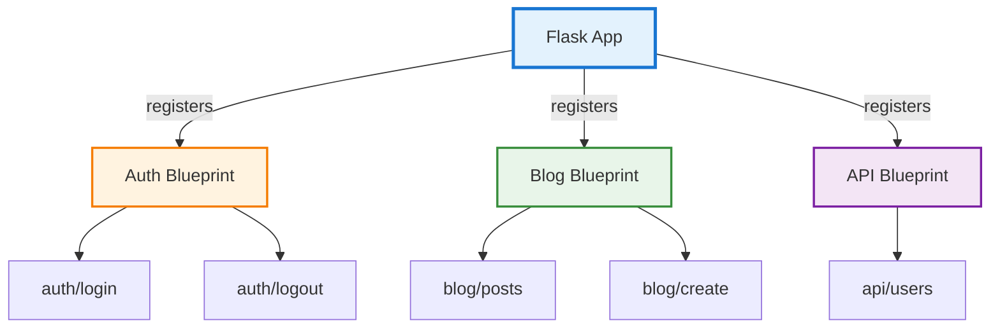
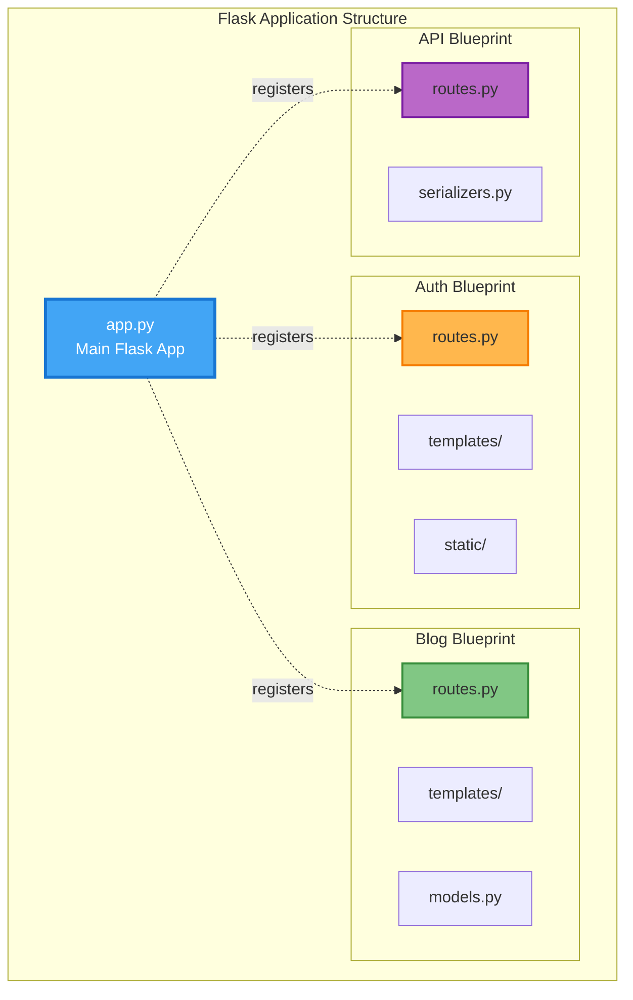
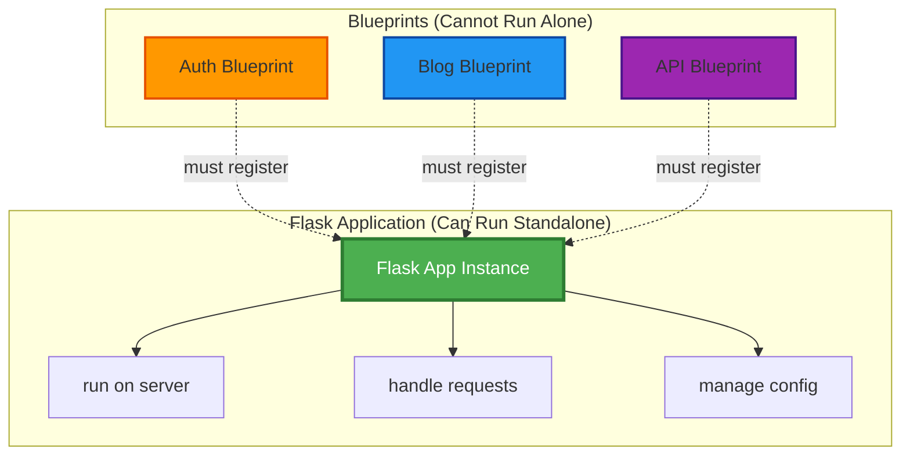
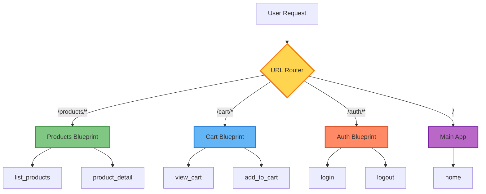

# Flask Blueprints - Interview Ready Notes

## What are Blueprints?

**Blueprints** are a way to organize Flask applications into smaller, reusable components. Think of them as mini-applications that can be registered with the main Flask app.



### Why Use Blueprints?

- **Modularity**: Break large apps into manageable pieces
- **Reusability**: Use the same blueprint across multiple projects
- **Team Collaboration**: Different teams work on different blueprints
- **Organization**: Group related routes, templates, and static files together

## Basic Structure

```
my_app/
├── app.py                 # Main application
├── config.py             
├── blueprints/
│   ├── auth/
│   │   ├── __init__.py
│   │   ├── routes.py
│   │   └── templates/
│   ├── blog/
│   │   ├── __init__.py
│   │   ├── routes.py
│   │   └── templates/
│   └── api/
│       ├── __init__.py
│       └── routes.py
```



## Creating a Blueprint

### Step 1: Define the Blueprint

```python
# blueprints/auth/__init__.py
from flask import Blueprint

auth_bp = Blueprint(
    'auth',                    # Blueprint name
    __name__,                  # Import name
    template_folder='templates',  # Optional
    static_folder='static',       # Optional
    url_prefix='/auth'            # All routes prefixed with /auth
)

from . import routes  # Import routes after blueprint creation
```

### Step 2: Add Routes

```python
# blueprints/auth/routes.py
from . import auth_bp
from flask import render_template, redirect, url_for

@auth_bp.route('/login')
def login():
    return render_template('auth/login.html')

@auth_bp.route('/logout')
def logout():
    return redirect(url_for('auth.login'))  # Note: 'auth.login'
```

### Step 3: Register with Main App

```python
# app.py
from flask import Flask
from blueprints.auth import auth_bp
from blueprints.blog import blog_bp

app = Flask(__name__)

# Register blueprints
app.register_blueprint(auth_bp)
app.register_blueprint(blog_bp, url_prefix='/blog')

if __name__ == '__main__':
    app.run(debug=True)
```

## Blueprint Parameters Explained

|Parameter|Purpose|Example|
|---|---|---|
|`name`|Blueprint identifier for `url_for()`|`'auth'` → `url_for('auth.login')`|
|`import_name`|Usually `__name__`, helps locate resources|`__name__`|
|`url_prefix`|Prepends to all route URLs|`/auth` → `/auth/login`|
|`template_folder`|Blueprint-specific templates|`'templates'`|
|`static_folder`|Blueprint-specific static files|`'static'`|
|`subdomain`|Restrict blueprint to subdomain|`'api'` → `api.example.com`|

## Common Interview Questions

### Q1: What's the difference between Blueprints and Applications?

**Answer**:

- A **Blueprint** is not a full application and can't run on its own
- Blueprints must be registered with a Flask app
- Multiple blueprints can be registered to one app
- An **Application** (Flask instance) is what actually runs the server



### Q2: How do you use `url_for()` with Blueprints?

**Answer**: Use the blueprint name as a prefix: `url_for('blueprint_name.function_name')`

```python
# Without blueprint
url_for('login')

# With blueprint named 'auth'
url_for('auth.login')
```

### Q3: Can Blueprints have their own templates and static files?

**Answer**: Yes! Blueprints can have their own folders:

```python
auth_bp = Blueprint('auth', __name__,
                   template_folder='templates',
                   static_folder='static')
```

Flask searches in this order:

1. Blueprint's template/static folder (if specified)
2. Main app's template/static folder (fallback)

### Q4: What are Blueprint Factories?

**Answer**: A pattern where you create blueprints using a function, useful for configuration:

```python
def create_auth_blueprint(config):
    auth_bp = Blueprint('auth', __name__)
    
    @auth_bp.route('/login')
    def login():
        # Use config here
        return render_template('login.html')
    
    return auth_bp

# In app.py
auth_bp = create_auth_blueprint(app.config)
app.register_blueprint(auth_bp)
```

### Q5: How do you handle errors in Blueprints?

**Answer**: Use `@blueprint.errorhandler()` for blueprint-specific errors:

```python
@auth_bp.errorhandler(404)
def auth_not_found(error):
    return render_template('auth/404.html'), 404
```

## Real-World Example: E-commerce App

### Project Structure

```
ecommerce/
├── app.py
├── config.py
├── blueprints/
│   ├── products/
│   │   ├── __init__.py
│   │   └── routes.py
│   ├── cart/
│   │   ├── __init__.py
│   │   └── routes.py
│   └── auth/
│       ├── __init__.py
│       └── routes.py
```

### Implementation

```python
# blueprints/products/__init__.py
from flask import Blueprint

products_bp = Blueprint('products', __name__, url_prefix='/products')

from . import routes

# blueprints/products/routes.py
from . import products_bp
from flask import jsonify

@products_bp.route('/')
def list_products():
    products = [
        {'id': 1, 'name': 'Laptop', 'price': 999},
        {'id': 2, 'name': 'Phone', 'price': 699}
    ]
    return jsonify(products)

@products_bp.route('/<int:id>')
def product_detail(id):
    return jsonify({'id': id, 'name': 'Product', 'price': 499})
```

```python
# blueprints/cart/__init__.py
from flask import Blueprint

cart_bp = Blueprint('cart', __name__, url_prefix='/cart')

from . import routes

# blueprints/cart/routes.py
from . import cart_bp
from flask import jsonify, session

@cart_bp.route('/')
def view_cart():
    cart = session.get('cart', [])
    return jsonify({'items': cart, 'total': len(cart)})

@cart_bp.route('/add/<int:product_id>')
def add_to_cart(product_id):
    cart = session.get('cart', [])
    cart.append(product_id)
    session['cart'] = cart
    return jsonify({'message': f'Added product {product_id}', 'cart_size': len(cart)})
```

```python
# blueprints/auth/__init__.py
from flask import Blueprint

auth_bp = Blueprint('auth', __name__, url_prefix='/auth')

from . import routes

# blueprints/auth/routes.py
from . import auth_bp
from flask import jsonify, session

@auth_bp.route('/login', methods=['POST'])
def login():
    session['user_id'] = 123
    return jsonify({'message': 'Logged in successfully'})

@auth_bp.route('/logout')
def logout():
    session.pop('user_id', None)
    return jsonify({'message': 'Logged out successfully'})
```

```python
# app.py
from flask import Flask, jsonify
from blueprints.products import products_bp
from blueprints.cart import cart_bp
from blueprints.auth import auth_bp

app = Flask(__name__)
app.secret_key = 'your-secret-key-here'

# Register all blueprints
app.register_blueprint(products_bp)
app.register_blueprint(cart_bp)
app.register_blueprint(auth_bp)

@app.route('/')
def home():
    return jsonify({
        'message': 'Welcome to E-commerce API',
        'endpoints': {
            'products': '/products/',
            'product_detail': '/products/<id>',
            'cart': '/cart/',
            'add_to_cart': '/cart/add/<product_id>',
            'login': '/auth/login',
            'logout': '/auth/logout'
        }
    })

if __name__ == '__main__':
    app.run(debug=True)
```

### How to Run

1. **Install Flask**:

```bash
pip install flask
```

2. **Run the application**:

```bash
python app.py
```

3. **Test the endpoints**:

```bash
# Get all products
curl http://localhost:5000/products/

# Get specific product
curl http://localhost:5000/products/1

# View cart
curl http://localhost:5000/cart/

# Add to cart
curl http://localhost:5000/cart/add/1

# Login (POST request)
curl -X POST http://localhost:5000/auth/login

# Logout
curl http://localhost:5000/auth/logout

# Home page
curl http://localhost:5000/
```

### Available URLs

|Endpoint|Blueprint|URL|Description|
|---|---|---|---|
|`home()`|Main App|`/`|API info page|
|`list_products()`|Products|`/products/`|List all products|
|`product_detail(id)`|Products|`/products/123`|Get product by ID|
|`view_cart()`|Cart|`/cart/`|View cart items|
|`add_to_cart(id)`|Cart|`/cart/add/123`|Add product to cart|
|`login()`|Auth|`/auth/login`|User login|
|`logout()`|Auth|`/auth/logout`|User logout|



### Request Flow Diagram

## Best Practices

✅ **DO:**

- Use blueprints for logical sections (auth, blog, API)
- Keep related routes together in one blueprint
- Use meaningful blueprint names
- Structure blueprints by feature, not by layer

❌ **DON'T:**

- Create too many small blueprints (overhead)
- Mix unrelated functionality in one blueprint
- Forget the `url_prefix` causing route conflicts
- Import blueprints circularly

## Quick Comparison

|Without Blueprints|With Blueprints|
|---|---|
|All routes in one file|Routes organized by feature|
|`app.route()` everywhere|`blueprint.route()` in modules|
|Hard to reuse code|Easy to plug in/out features|
|Difficult team collaboration|Teams work independently|
|Messy large applications|Clean, maintainable structure|

## Memory Tips

🔹 **Blueprint = Mini App** - It's like a plugin you attach to Flask 🔹 **Registration Required** - Blueprints don't work until registered 🔹 **URL Prefix** - Automatically prepends to all routes 🔹 **Name Matters** - Used in `url_for('blueprint.route')`

## One-Liner for Interviews

_"Flask Blueprints are a way to organize large applications into modular, reusable components that can be registered with the main Flask app, making code more maintainable and allowing teams to work on different features independently."_

**Last Updated**: November 2025
**Status**: Interview Ready ✅