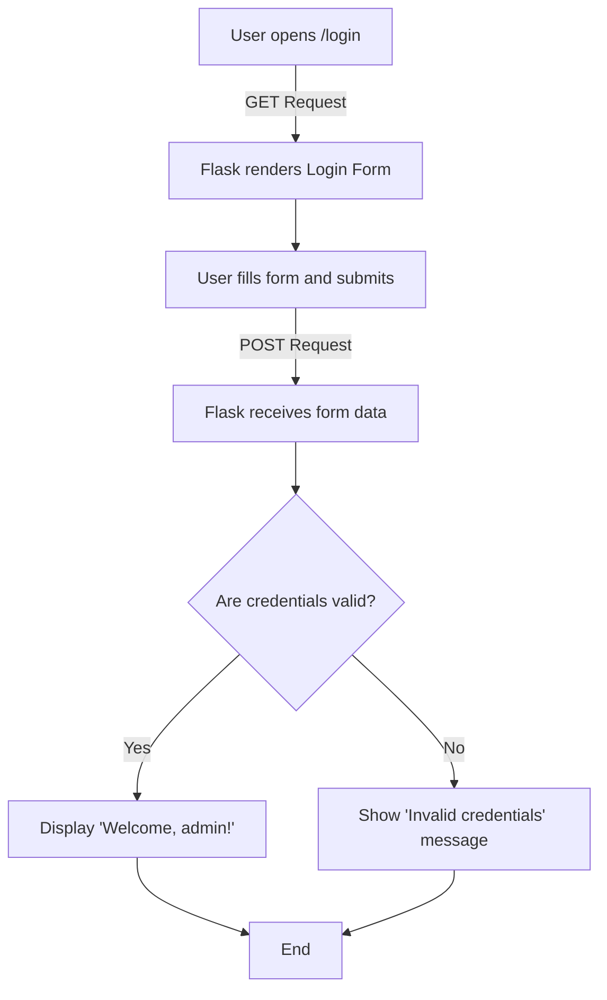

---
#### HTTP Methods List

| **Method** | **Purpose**                    | **Typical Use Case**                                               |
| ---------- | ------------------------------ | ------------------------------------------------------------------ |
| GET        | Retrieve data                  | Fetch a web page, list, or resource                                |
| POST       | Create new data                | Submit a form, create a user, upload data                          |
| PUT        | Replace an existing resource   | Update or completely replace an item                               |
| PATCH      | Partially update a resource    | Update specific fields only                                        |
| DELETE     | Remove a resource              | Delete a record or object                                          |
| HEAD       | Retrieve headers only          | Get metadata without body (auto-handled if GET exists)             |
| OPTIONS    | Discover allowed methods       | Tell clients what HTTP verbs are supported (auto-handled by Flask) |
| CONNECT    | Establish a tunnel (proxy use) | Rare in web apps — mostly for HTTPS proxies                        |
| TRACE      | Echo request (for debugging)   | Used in diagnostics — usually disabled for security                |

---
## 1. HTTP Methods
- Web applications use different **HTTP methods** to interact with resources.  
- By default, Flask routes respond only to `GET` requests, but you can handle others (like `POST`, `PUT`, `DELETE`) using the `methods` argument in `@app.route()`.
### 1.1 Example — Handling Multiple HTTP Methods in One Route
```python
from flask import Flask, request, render_template_string

app = Flask(__name__)

# HTML Template (inline for simplicity)
login_form_html = """
<!doctype html>
<html lang="en">
<head>
    <title>Login Page</title>
</head>
<body style="font-family:Arial; margin:50px;">
    <h2>Login Form</h2>
    <form method="POST" action="/login">
        <label>Username:</label>
        <input type="text" name="username" required><br><br>
        <label>Password:</label>
        <input type="password" name="password" required><br><br>
        <input type="submit" value="Login">
    </form>
</body>
</html>
"""

@app.route('/login', methods=['GET', 'POST'])
def login():
    # Flask uses request.method to check which HTTP verb was used
    if request.method == 'POST':
        # Access form data sent via POST
        username = request.form.get('username')
        password = request.form.get('password')

        # Simple validation example
        if username == "admin" and password == "1234":
            return f"<h3>Welcome, {username}!</h3>"
        else:
            return "<h3>Invalid credentials. Please try again.</h3>"
    else:
        # On GET request — show the login form
        return render_template_string(login_form_html)

if __name__ == '__main__':
    app.run(debug=True)  # debug=True : To auto-reload on changes
```
- `render_template_string` : for demonstration only
- in real-world apps, use:  `return render_template("login.html")` with an actual HTML file inside a `/templates` folder.
- To run : Save the Flask code in a file named: `app.py`
- **Activate your virtual environment**  [[Flask Installation]]
1. Windows (PowerShell):
```bash
.venv\Scripts\activate
```
2. Linux/macOS:
```bash
source venv/bin/activate
```
- **Run using the Flask CLI**
```bash
flask --app app run 
# or
flask --app app run --debug # To auto-reload on changes
```
- **or using below command**
```bash
python3 app.py # Linux
python app.py # Windows
```
- You’ll see:
```bash
 * Serving Flask app 'test'
 * Debug mode: on  #if set debug=True or Using flask --app login_app run --debug
WARNING: This is a development server. Do not use it in a production deployment. Use a production WSGI server instead.
 * Running on http://127.0.0.1:5000
Press CTRL+C to quit
 * Restarting with stat
 * Debugger is active!
 * Debugger PIN: 124-132-469
```
- Visit:
```bash
http://127.0.0.1:5000/login
```
- You’ll see your **Login Form**.  
- Try submitting: Username: `admin`  Password: `1234`
- Output : **“Welcome, admin!”**
- Try anything else → **“Invalid credentials. Please try again.”**
#### How it's working

| Step                       | HTTP Method | What Happens                               |
| -------------------------- | ----------- | ------------------------------------------ |
| **1. User opens `/login`** | GET         | Flask renders the login HTML form          |
| **2. User submits form**   | POST        | Flask receives data, validates credentials |
| **3. If valid**            | POST        | Shows a welcome message                    |
| **4. If invalid**          | POST        | Displays an error message                  |
#### Flowchart


### 1.2 Example — Separate Handlers for GET and POST
- Flask also provides shortcuts like `.get()`, `.post()`, etc.
```python
@app.get('/login')
def login_get():
    return show_the_login_form()

@app.post('/login')
def login_post():
    return do_the_login()
```
**Benefits:**
- Clear separation of logic for each method
-  Easier to maintain and test
### 1.3 Auto-Implemented HTTP Methods
- If `GET` is defined, Flask automatically adds support for **HEAD**.
- **OPTIONS** requests are automatically handled according to HTTP standards.
### Summary

| Concept / Feature      | Key Points                                                               |
| ---------------------- | ------------------------------------------------------------------------ |
| **HTTP Methods**       | GET, POST, PUT, PATCH, DELETE, HEAD, OPTIONS, CONNECT, TRACE             |
| **GET**                | Retrieves resources; auto-handles HEAD                                   |
| **POST**               | Creates new resources; sends data in request body                        |
| **PUT / PATCH**        | PUT: full update, PATCH: partial update                                  |
| **DELETE**             | Deletes a resource                                                       |
| **HEAD / OPTIONS**     | Auto-implemented by Flask when GET or route exists                       |
| **Routing in Flask**   | `@app.route('/path', methods=[...])` binds URL to function               |
| **Separate Handlers**  | `.get()` and `.post()` can be used for clearer logic separation          |
| **Form Handling**      | Use `request.method` to differentiate GET vs POST                        |
| **Inline Templates**   | `render_template_string()` for demos; `render_template()` for production |
| **Flow**               | GET → show form; POST → process data → success/failure messages          |
| **Validation Example** | Check username/password in POST; show welcome or error                   |
| **Debug Mode**         | `app.run(debug=True)` auto-reloads changes; useful during development    |
