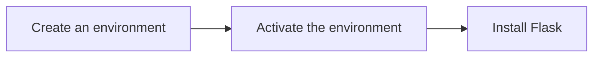

#### [[A - Table of Content]]
---
###  Virtual environments
- Virtual environments are independent groups of Python libraries, one for each project. 
- Packages installed for one project will not affect other projects or the operating system’s packages.
- Use a virtual environment to manage the dependencies for your project, both in development and in production.
---

# Setup Steps

- Follow these steps to isolate your Flask project dependencies.
### 1. Create an environment
-  Create a project folder and a `.venv` folder within:
   ```bash
	mkdir myproject
	cd myproject
	python3 -m venv .venv
     ```
### 2.  Activate the environment
- Before you work on your project, activate the corresponding environment:
  ```bash
	source .venv/bin/activate
  ```
- In Window Git Bash shell
    ```bash
	source .venv/Scripts/activate
  ```
- In Window Command Prompt  shell
    ```cmd
	.venv\Scripts\activate
  ```
- Your shell prompt will change to show the name of the activated environment.
### 3. Install Flask
- Within the activated environment, use the following command to install Flask:
  ```bash
  pip install Flask
  ```
- Flask is now installed.

### Installation Flowchart


---
## Flask Dependencies
These distributions will be installed automatically when installing Flask.
- [Werkzeug](https://palletsprojects.com/p/werkzeug/) implements WSGI, the standard Python interface between applications and servers.
- [Jinja](https://palletsprojects.com/p/jinja/) is a template language that renders the pages your application serve
- [MarkupSafe](https://palletsprojects.com/p/markupsafe/) comes with Jinja. It escapes untrusted input when rendering templates to avoid injection attacks.
- [ItsDangerous](https://palletsprojects.com/p/itsdangerous/) securely signs data to ensure its integrity. This is used to protect Flask’s session cookie.
- [Click](https://palletsprojects.com/p/click/) is a framework for writing command line applications. It provides the `flask` command and allows adding custom management commands.
- [Blinker](https://blinker.readthedocs.io/) provides support for [Signals](https://flask.palletsprojects.com/en/stable/signals/).
---
