# Flask Virtual Environments & Installation

## What are Virtual Environments?

Virtual environments are **isolated Python environments** that allow you to manage dependencies on a per-project basis.

### Key Benefits

- ✅ **Isolation**: Each project has its own set of packages
- ✅ **No Conflicts**: Different projects can use different versions of the same package
- ✅ **Reproducibility**: Easy to recreate the exact environment on another machine
- ✅ **Clean System**: Doesn't pollute global Python installation

### The Problem Without Virtual Environments

```
Global Python Installation
├── Project A needs Flask 2.0
├── Project B needs Flask 3.0  ❌ CONFLICT!
└── System tools may break if packages change
```

### The Solution With Virtual Environments

```
├── Project A
│   └── .venv (Flask 2.0) ✅
├── Project B
│   └── .venv (Flask 3.0) ✅
└── Global Python (clean) ✅
```

---

## Setup Process

### 1. Create Virtual Environment

```bash
# Create project folder
mkdir myproject
cd myproject

# Create virtual environment
python -m venv .venv
```

**Alternative commands** (if `python` doesn't work):

```bash
python3 -m venv .venv
py -m venv .venv
py -3.11 -m venv .venv  # Specific Python version
```

### 2. Activate Virtual Environment

Your shell prompt will change to show `(.venv)` when activated.

#### Linux / macOS

```bash
source .venv/bin/activate
```

#### Windows Git Bash

```bash
source .venv/Scripts/activate
```

#### Windows Command Prompt

```cmd
.venv\Scripts\activate
```

#### Windows PowerShell

```powershell
.venv\Scripts\Activate.ps1

# If you get execution policy error, run this first (as admin):
Set-ExecutionPolicy -ExecutionPolicy RemoteSigned -Scope CurrentUser
```

### 3. Install Flask

```bash
# Install Flask (and all dependencies)
pip install Flask

# Or install specific version
pip install Flask==3.0.0
```

### 4. Verify Installation

```bash
# Check Flask version
flask --version

# Check via Python
python -c "import flask; print(flask.__version__)"

# List all installed packages
pip list
```

**Expected output:**

```
Flask 3.0.0
Python 3.11.x
Werkzeug 3.0.x
```

### 5. Deactivate (When Done)

```bash
deactivate
```

Your prompt will return to normal (no `.venv` prefix).

---

## Installation Flow Diagram

```mermaid
flowchart TD
    A[📁 Create Project Directory] --> B[🐍 Create Virtual Environment<br/>python -m venv .venv]
    B --> C{Activate Based on OS}
    
    C -->|Linux/Mac| D[source .venv/bin/activate]
    C -->|Windows Git Bash| E[source .venv/Scripts/activate]
    C -->|Windows CMD| F[.venv\Scripts\activate]
    C -->|PowerShell| G[.venv\Scripts\Activate.ps1]
    
    D --> H[📦 Install Flask<br/>pip install Flask]
    E --> H
    F --> H
    G --> H
    
    H --> I[✅ Verify<br/>flask --version]
    I --> J[💻 Development Work]
    J --> K[🛑 Deactivate<br/>deactivate]
    
    style A fill:#e3f2fd
    style B fill:#fff3e0
    style H fill:#c8e6c9
    style I fill:#fff9c4
    style J fill:#f3e5f5
    style K fill:#ffcdd2
```



---

## Flask Dependencies (Auto-Installed)

When you install Flask, these packages are automatically installed:

|Package|Purpose|Interview Talking Point|
|---|---|---|
|**Werkzeug**|WSGI utility library|Handles HTTP requests/responses, routing, debugging|
|**Jinja2**|Template engine|Renders dynamic HTML with variables and logic|
|**MarkupSafe**|String escaping|Prevents XSS attacks by auto-escaping HTML|
|**ItsDangerous**|Data signing|Securely signs session cookies and tokens|
|**Click**|CLI framework|Powers `flask` command and custom CLI tools|
|**Blinker**|Signal support|Event system for request/response lifecycle hooks|
<!--SR:!2000-01-01,1,250!2000-01-01,1,250!2000-01-01,1,250!2000-01-01,1,250!2000-01-01,1,250!2025-11-17,4,270-->

### Dependency Tree

```
Flask
├── Werkzeug (WSGI interface)
├── Jinja2 (templating)
│   └── MarkupSafe (security)
├── ItsDangerous (cryptography)
├── Click (CLI)
└── Blinker (signals)
```

---

## Managing Dependencies

### Create Requirements File

```bash
# Export current environment
pip freeze > requirements.txt
```

**Example `requirements.txt`:**

```
Flask==3.0.0
Flask-SQLAlchemy==3.1.0
python-dotenv==1.0.0
requests==2.31.0
```

### Install from Requirements File

```bash
# Install all dependencies
pip install -r requirements.txt

# Useful for:
# - Setting up project on new machine
# - Onboarding new developers
# - Deploying to production
```

### Update Dependencies

```bash
# Update a specific package
pip install --upgrade Flask

# Update all packages (careful!)
pip list --outdated
pip install --upgrade package_name
```

---

## Common Issues & Solutions

### ❌ Issue: `python: command not found`

```bash
# Try these alternatives:
python3 -m venv .venv
py -m venv .venv
```

### ❌ Issue: `pip: command not found` (after activation)

```bash
# Use python -m pip instead:
python -m pip install Flask
```

### ❌ Issue: PowerShell script execution disabled

```powershell
# Enable script execution (run as admin):
Set-ExecutionPolicy -ExecutionPolicy RemoteSigned -Scope CurrentUser
```

### ❌ Issue: Wrong Python version in venv

```bash
# Specify exact Python version:
python3.11 -m venv .venv
py -3.11 -m venv .venv

# Check Python version:
python --version
```

### ❌ Issue: Virtual environment already exists

```bash
# Delete and recreate:
rm -rf .venv  # Linux/Mac
rmdir /s .venv  # Windows

# Then recreate:
python -m venv .venv
```

### ❌ Issue: Packages installing globally instead of in venv

```bash
# Make sure venv is activated (check for (.venv) in prompt)
# Verify pip location:
which pip  # Linux/Mac
where pip  # Windows

# Should show path inside .venv folder
```

---

## Best Practices

### ✅ DO

- **Always activate venv** before working on a project
- **Use `.gitignore`** to exclude `.venv/` from version control
- **Use `requirements.txt`** to track dependencies
- **Create separate venv** for each project
- **Document Python version** in README or `.python-version` file
- **Pin package versions** in production (`Flask==3.0.0` not `Flask`)
<!--SR:!2025-11-18,4,272!2000-01-01,1,250!2025-11-18,4,272!2000-01-01,1,250!2000-01-01,1,250!2000-01-01,1,250-->

### ❌ DON'T

- **Never commit `.venv/`** to Git (wastes space, causes conflicts)
- **Don't install packages globally** when working on projects
- **Don't mix dependencies** from different projects
- **Don't forget to activate venv** (check your terminal prompt!)
- **Don't use `sudo pip install`** (use venv instead)

---

## Interview Questions & Answers

### Q1: What is a virtual environment and why use it?

**Answer:** A virtual environment is an isolated Python environment that contains its own Python interpreter and installed packages. We use it to:

- Avoid dependency conflicts between projects
- Keep the global Python installation clean
- Ensure reproducible environments across machines
- Manage different package versions for different projects

### Q2: How do you create and activate a virtual environment?

**Answer:**

```bash
# Create
python -m venv .venv

# Activate (Linux/Mac)
source .venv/bin/activate

# Activate (Windows)
.venv\Scripts\activate
```

### Q3: What's the difference between `pip` and `pip3`?

**Answer:**

- `pip` typically refers to Python 2 (deprecated)
- `pip3` refers to Python 3
- In virtual environments, `pip` automatically uses the environment's Python version
- Best practice: Use `python -m pip` to ensure correct Python version

### Q4: How do you share your project's dependencies?

**Answer:**

```bash
# Export dependencies
pip freeze > requirements.txt

# Install on another machine
pip install -r requirements.txt
```

### Q5: What files should be in `.gitignore` for Flask projects?

**Answer:**

```
.venv/
__pycache__/
*.pyc
instance/
.env
*.db
```

### Q6: What are Flask's core dependencies?

**Answer:**

- **Werkzeug**: WSGI interface for handling HTTP
- **Jinja2**: Template engine for rendering HTML
- **Click**: CLI framework for `flask` command
- **ItsDangerous**: Cryptographic signing for sessions
- **MarkupSafe**: XSS protection via auto-escaping
- **Blinker**: Signal/event system

### Q7: How do you handle different environments (dev/prod)?

**Answer:**

```bash
# Use separate requirements files
requirements/
├── base.txt      # Common dependencies
├── dev.txt       # Development tools (includes base.txt)
└── prod.txt      # Production only (includes base.txt)

# Install
pip install -r requirements/dev.txt
```

### Q8: What's the difference between `pip install` and `pip install -e`?

**Answer:**

- `pip install package`: Regular installation
- `pip install -e .`: Editable/development mode
    - Changes to source code immediately reflected
    - Used when developing a package
    - Links to source directory instead of copying files

---

## Quick Reference Card

```bash
# CREATE & ACTIVATE
python -m venv .venv
source .venv/bin/activate  # Linux/Mac
.venv\Scripts\activate     # Windows

# INSTALL & VERIFY
pip install Flask
flask --version

# MANAGE DEPENDENCIES
pip freeze > requirements.txt
pip install -r requirements.txt

# DEACTIVATE
deactivate

# COMMON CHECKS
which python  # Should show .venv path
pip list      # See installed packages
```

---

## Project Structure Template

```
myproject/
├── .venv/                 # Virtual environment (not in Git)
├── .gitignore             # Exclude .venv, __pycache__, etc.
├── requirements.txt       # Python dependencies
├── app.py                 # Main Flask application
├── config.py              # Configuration
├── templates/             # Jinja2 templates
├── static/                # CSS, JS, images
└── README.md              # Setup instructions
```

**Minimal `.gitignore`:**

```
.venv/
__pycache__/
*.pyc
.env
instance/
```

---

## Summary

|Action|Command|
|---|---|
|**Create venv**|`python -m venv .venv`|
|**Activate (Linux/Mac)**|`source .venv/bin/activate`|
|**Activate (Windows)**|`.venv\Scripts\activate`|
|**Install Flask**|`pip install Flask`|
|**Verify**|`flask --version`|
|**Export deps**|`pip freeze > requirements.txt`|
|**Install deps**|`pip install -r requirements.txt`|
|**Deactivate**|`deactivate`|
<!--SR:!2000-01-01,1,250!2000-01-01,1,250!2000-01-01,1,250!2000-01-01,1,250!2000-01-01,1,250!2000-01-01,1,250!2000-01-01,1,250!2025-11-18,4,272-->

---

**Last Updated**: November 2025  
**Status**: Interview Ready ✅