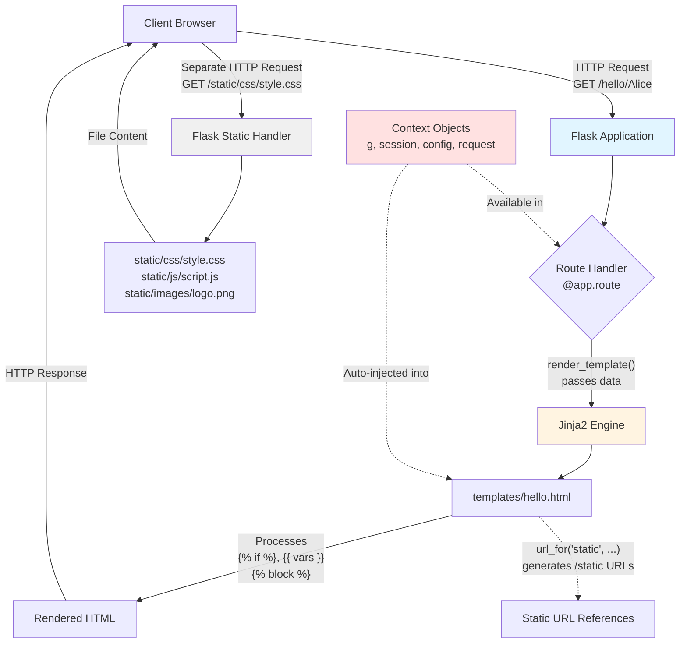

# Flask Templates & Static Files - Complete Guide

## 1. Rendering Templates

Flask uses the [Jinja2 Template Engine](https://jinja.palletsprojects.com/templates/) for rendering HTML and other text formats. Templates live in a `templates` folder by default.

### Folder Structure

#### Module structure example:

```bash
/application.py
/templates
    hello.html
```

#### Package structure example:

```bash
/application
    __init__.py
    /templates
        hello.html
```

### Basic `render_template` Usage

```python
from flask import Flask, render_template

app = Flask(__name__)

@app.route('/hello/')
@app.route('/hello/<name>')
def hello(name=None):
    return render_template('hello.html', person=name)
```

### Example Jinja Template (`hello.html`)

```html
<!doctype html>
<html>
<head>
    <title>Hello from Flask</title>
</head>
<body>
    
        <h1>Hello {{ person }}!</h1>
    
        <h1>Hello, World!</h1>
    
</body>
</html>
```

### Template Context Objects

Templates **automatically** have access to these Flask objects without explicitly passing them:

- `config` - Application configuration
- `request` - Current HTTP request object
- `session` - User session data
- `g` - Request-scoped temporary storage
- `url_for()` - URL generation function
- `get_flashed_messages()` - Retrieve flash messages

### The `flask.g` Object

`g` is a **per-request global** for sharing temporary data between functions during a single request.

**Example: Database Connection**
<!--SR:!2025-11-17,4,270-->

```python
from flask import g
import sqlite3

@app.before_request
def before_request():
    g.db = sqlite3.connect('database.db')  # Store DB connection

@app.teardown_request
def teardown_request(exception):
    db = getattr(g, 'db', None)
    if db is not None:
        db.close()  # Clean up after request

@app.route('/users')
def get_users():
    cursor = g.db.cursor()  # Access DB from g
    users = cursor.execute('SELECT * FROM users').fetchall()
    return render_template('users.html', users=users)
```

### Template Inheritance

Template inheritance allows you to reuse common layouts using `` and `` tags.

**Base Template (`base.html`):**

```html
<!DOCTYPE html>
<html>
<head>
    <title>My Site</title>
    <link rel="stylesheet" href="{{ url_for('static', filename='style.css') }}">
</head>
<body>
    <header>
        <nav>
            <a href="{{ url_for('home') }}">Home</a>
            <a href="{{ url_for('about') }}">About</a>
        </nav>
    </header>
    
    <main>
        
    </main>
    
    <footer>
        <p>&copy; 2025 My Site</p>
    </footer>
</body>
</html>
```

**Child Template (`hello.html`):**
<!--SR:!2025-11-17,4,270-->

```html


Hello Page


    <h1>Hello {{ person }}!</h1>
    <p>Welcome to our site!</p>

```

### Common Jinja2 Filters

```html
{{ name|upper }}              <!-- UPPERCASE -->
{{ name|lower }}              <!-- lowercase -->
{{ text|truncate(20) }}       <!-- Limit to 20 chars -->
{{ price|round(2) }}          <!-- Round to 2 decimals -->
{{ items|length }}            <!-- Get list length -->
{{ date|default('N/A') }}     <!-- Default value if empty -->
{{ html_content|safe }}       <!-- Disable escaping (use carefully!) -->
```

### Automatic Escaping & Security

Jinja2 **automatically escapes HTML special characters** in variables to prevent **XSS (Cross-Site Scripting) attacks**.

**How Auto-Escaping Works:**

```python
from markupsafe import Markup

# User input is automatically escaped
Markup('<strong>Hello %s!</strong>') % '<blink>hacker</blink>'
# Output: '<strong>Hello &lt;blink&gt;hacker&lt;/blink&gt;!</strong>'

Markup.escape('<blink>hacker</blink>')
# Output: '&lt;blink&gt;hacker&lt;/blink&gt;'

Markup('<em>Marked up</em> &raquo; HTML').striptags()
# Output: 'Marked up » HTML'
```

**Safe vs. Unsafe Rendering:**

```python
# ❌ UNSAFE - Direct HTML rendering (XSS vulnerability!)
@app.route('/greet/<name>')
def greet_unsafe(name):
    return f"<h1>Hello {name}!</h1>"  # User can inject <script> tags!

# ✅ SAFE - Template with auto-escaping
@app.route('/greet/<name>')
def greet_safe(name):
    return render_template('greet.html', name=name)
```

**When to Use `|safe` or `Markup`:**

```html
<!-- Only use |safe for trusted HTML you control -->

{{ company_slogan|safe }}

<!-- Never use |safe on user input! -->
<!-- ❌ BAD: {{ user_comment|safe }} -->
<!-- ✅ GOOD: {{ user_comment }} (auto-escaped) -->
```

---

## 2. Static Files

Dynamic web applications need **CSS, JavaScript, and images**. Flask serves these from a `static` folder during development.

### Folder Structure

```bash
/your_app.py
/static
    /css
        style.css
    /js
        script.js
    /images
        logo.png
```

### Accessing Static Files in Templates

Use `url_for('static', filename='...')` to generate URLs:

```html
<!DOCTYPE html>
<html>
<head>
    <!-- CSS -->
    <link rel="stylesheet" href="{{ url_for('static', filename='css/style.css') }}">
</head>
<body>
    <!-- Image -->
    
    
    <!-- JavaScript -->
    <script src="{{ url_for('static', filename='js/script.js') }}"></script>
</body>
</html>
```

**Why use `url_for()` instead of hardcoding `/static/style.css`?**

- ✅ Works correctly if you change the static folder location
- ✅ Handles URL prefixes automatically (e.g., when app is at `/myapp/`)
- ✅ Can add cache-busting query parameters
- ✅ Flask convention for consistency

### Static Files in Python Code

```python
from flask import url_for

@app.route('/')
def index():
    css_url = url_for('static', filename='css/style.css')
    # Generates: /static/css/style.css
    return render_template('index.html')
```

### Production Deployment Note

⚠️ **Important**: Flask's built-in static file serving is intended for **development only**.
<!--SR:!2000-01-01,1,250!2025-11-17,4,270-->

**In production:**

- Use a proper web server (Nginx, Apache) to serve static files
- Or use a CDN (Content Delivery Network)
- This dramatically improves performance and reduces server load

**Example Nginx Configuration:**

```nginx
location /static {
    alias /path/to/your/app/static;
    expires 30d;  # Cache for 30 days
}
```

---

## 3. Summary Table

|Concept|Key Points|
|---|---|
|**Templates**|HTML in `/templates`; render via `render_template()`|
|**Jinja2 Features**|Conditional logic, loops, filters, template inheritance|
|**Template Inheritance**|Use `` and `` for reusable layouts|
|**Context Objects**|Templates auto-access `config`, `request`, `session`, `g`, `url_for()`|
|**Global `g` Object**|Store per-request data like DB connections or user info|
|**Security**|Auto-escaping prevents XSS; use `Markup` or `|
|**Static Files**|CSS/JS/images in `/static`; use `url_for('static', filename='...')`|
|**url_for()**|Generates URLs dynamically; better than hardcoding paths|
|**Production**|Use Nginx/Apache/CDN for static files, not Flask|
<!--SR:!2025-11-18,4,276!2000-01-01,1,250!2000-01-01,1,250!2000-01-01,1,250!2000-01-01,1,250!2000-01-01,1,250!2000-01-01,1,250!2000-01-01,1,250!2000-01-01,1,250-->

---

## 4. Request Flow Diagram



### Key Flow Points:

1. **Main Request-Response Cycle**: Client → Flask → Route → Template → Response
2. **Context Objects**: Available to both routes and templates automatically
3. **Static Files**: Separate HTTP requests; templates generate URLs with `url_for()`
4. **Template Processing**: Jinja2 evaluates logic, variables, and blocks before sending HTML

---

## 5. Best Practices

### ✅ DO:

- Always use `url_for()` for generating URLs (routes and static files)
- Use template inheritance to avoid duplicating HTML structure
- Keep business logic in route handlers, not templates
- Validate and sanitize user input before passing to templates
- Use `` tags for customizable sections in base templates

### ❌ DON'T:

- Never use `|safe` filter on user-generated content
- Don't hardcode URLs like `/static/style.css` or `/hello/`
- Don't put complex Python logic in templates (use route handlers)
- Don't serve static files with Flask in production environments
- Don't forget to close resources stored in `g` (use `@app.teardown_request`)

---

## 6. Complete Working Example

### File Structure

```bash
flask_app/
├── app.py
├── create_db.py
├── users.db (generated)
└── templates/
    ├── base.html
    ├── home.html
    └── profile.html
```

### Setup & Run

**1. Create Database (`create_db.py`):**

```python
import sqlite3
conn = sqlite3.connect('users.db')
cursor = conn.cursor()
cursor.execute('CREATE TABLE IF NOT EXISTS users (id INTEGER PRIMARY KEY, username TEXT, email TEXT)')
cursor.executemany('INSERT OR IGNORE INTO users VALUES (?,?,?)', 
                   [(1, 'alice', 'alice@example.com'), (2, 'bob', 'bob@example.com')])
conn.commit()
conn.close()
print("✅ Database created!")
```

**2. Main App (`app.py`):**

```python
from flask import Flask, render_template, g
import sqlite3

app = Flask(__name__)
app.secret_key = 'your-secret-key'

@app.before_request
def before_request():
    g.db = sqlite3.connect('users.db')

@app.teardown_request
def teardown_request(exception):
    db = getattr(g, 'db', None)
    if db is not None:
        db.close()

@app.route('/')
def home():
    return render_template('home.html')

@app.route('/profile/<username>')
def profile(username):
    cursor = g.db.cursor()
    user = cursor.execute('SELECT * FROM users WHERE username = ?', (username,)).fetchone()
    return render_template('profile.html', user=user)

if __name__ == '__main__':
    app.run(debug=True)
```

**3. Templates:**

`base.html`:

```html
<!DOCTYPE html>
<html>
<head>
    <title>My Site</title>
</head>
<body>
    <nav><a href="{{ url_for('home') }}">Home</a></nav>
    <main></main>
</body>
</html>
```

`home.html`:

```html


    <h1>Welcome</h1>
    <a href="{{ url_for('profile', username='alice') }}">Alice</a> |
    <a href="{{ url_for('profile', username='bob') }}">Bob</a>

```

`profile.html`:

```html


    
        <h1>{{ user[1] }}</h1>
        <p>Email: {{ user[2] }}</p>
    
        <h1>User not found</h1>
    

```

**4. Run Commands:**
<!--SR:!2025-11-18,4,276-->

```bash
mkdir flask_app && cd flask_app
mkdir templates
pip install flask
python create_db.py
python app.py
# Visit: http://127.0.0.1:5000
```

---

## 7. Additional Resources

- **Official Flask Documentation**: [https://flask.palletsprojects.com/](https://flask.palletsprojects.com/)
- **Jinja2 Documentation**: [https://jinja.palletsprojects.com/](https://jinja.palletsprojects.com/)
- **Flask Mega-Tutorial**: Comprehensive guide to building Flask applications
- **OWASP XSS Prevention**: Best practices for preventing cross-site scripting

---

**Last Updated**: November 2025