# Vue.js - Beginner Notes

## What is Vue.js?

Vue.js is a **JavaScript framework** for building user interfaces. It makes creating interactive websites easier by automatically updating the page when data changes.

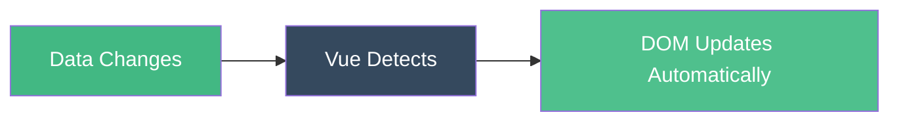

**Simple Analogy**: Vue is like a smart assistant that watches your data and updates the webpage whenever something changes - no manual work needed!

---

## 1. Creating a Vue App

### Basic Structure

```html
<!DOCTYPE html>
<html>
<head>
    <script src="https://cdn.jsdelivr.net/npm/vue@3"></script>
</head>
<body>
    <div id="app">
        <h1>{{ message }}</h1>
    </div>

    <script>
        const { createApp } = Vue;
        
        createApp({
            data() {
                return {
                    message: 'Hello Vue!'
                }
            }
        }).mount('#app');
    </script>
</body>
</html>
```

**Output**: Shows "Hello Vue!" on the page

**Key Point**: `{{ message }}` is replaced with the actual value from `data()`

---

## 2. Data & Reactivity

Data properties are **reactive** - when they change, the page updates automatically.

```javascript
createApp({
    data() {
        return {
            name: 'Alice',
            age: 25,
            isStudent: true
        }
    }
}).mount('#app');
```

```html
<div id="app">
    <p>Name: {{ name }}</p>
    <p>Age: {{ age }}</p>
    <p>Student: {{ isStudent }}</p>
</div>
```

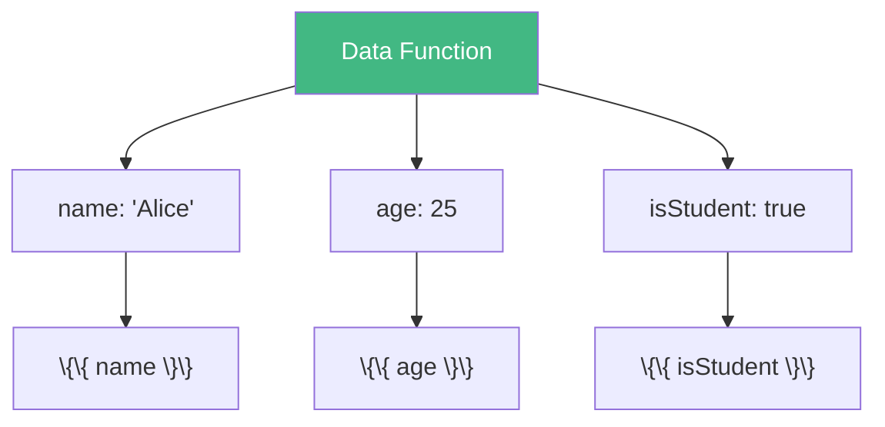

---

## 3. Methods

Functions you can call from the template.

```javascript
createApp({
    data() {
        return {
            count: 0
        }
    },
    methods: {
        increment() {
            this.count++;
        },
        decrement() {
            this.count--;
        }
    }
}).mount('#app');
```

```html
<div id="app">
    <p>Count: {{ count }}</p>
    <button @click="increment">+</button>
    <button @click="decrement">-</button>
</div>
```

**Output**: Clicking buttons changes the count

---

## 4. Event Handling (@click, @input)

### Click Events

```html
<button @click="sayHello">Click Me</button>
```

```javascript
methods: {
    sayHello() {
        alert('Hello!');
    }
}
```

### Input Events

```html
<input @input="handleInput" placeholder="Type something">
<p>You typed: {{ text }}</p>
```

```javascript
data() {
    return { text: '' }
},
methods: {
    handleInput(event) {
        this.text = event.target.value;
    }
}
```

```mermaid
graph LR
    A[User Clicks Button] --> B[@click triggers]
    B --> C[Method Runs]
    C --> D[Data Updates]
    D --> E[Page Re-renders]
    
    style B fill:#ffd700,color:#000
    style C fill:#42b883,color:#fff
```

---

## 5. Two-Way Binding (v-model)

**v-model** automatically syncs input with data.

```html
<div id="app">
    <input v-model="username" placeholder="Enter name">
    <p>Hello, {{ username }}!</p>
</div>
```

```javascript
data() {
    return {
        username: ''
    }
}
```

**Magic**: As you type, `username` updates and the `<p>` changes instantly!

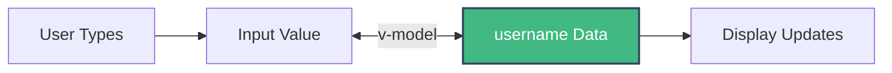

### More v-model Examples

```html
<!-- Checkbox -->
<input type="checkbox" v-model="agree">
<p>Agreed: {{ agree }}</p>

<!-- Radio Buttons -->
<input type="radio" v-model="color" value="red"> Red
<input type="radio" v-model="color" value="blue"> Blue
<p>Selected: {{ color }}</p>

<!-- Select Dropdown -->
<select v-model="city">
    <option value="NY">New York</option>
    <option value="LA">Los Angeles</option>
</select>
<p>City: {{ city }}</p>
```

---

## 6. Conditional Rendering (v-if, v-else, v-show)

### v-if / v-else

Shows or hides elements based on conditions.

```html
<div id="app">
    <button @click="isLoggedIn = !isLoggedIn">Toggle Login</button>
    
    <p v-if="isLoggedIn">Welcome back!</p>
    <p v-else>Please log in</p>
</div>
```

```javascript
data() {
    return {
        isLoggedIn: false
    }
}
```

### v-show

Similar to v-if but uses CSS display property.

```html
<p v-show="isVisible">I can be hidden!</p>
```

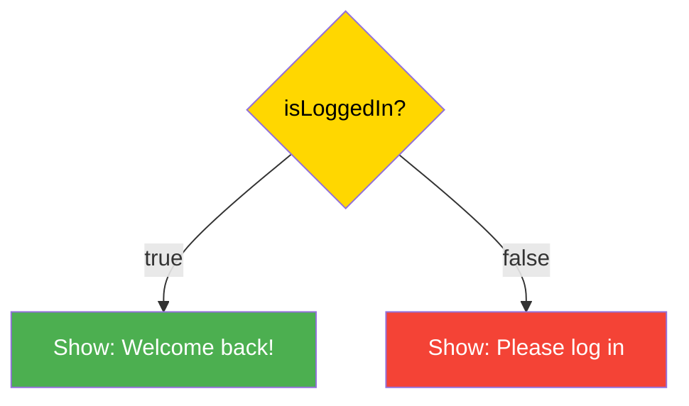

**Difference**:

- **v-if**: Removes element from DOM (use for infrequent changes)
- **v-show**: Just hides with CSS (use for frequent toggling)

---

## 7. List Rendering (v-for)

Loop through arrays to create multiple elements.

```html
<div id="app">
    <ul>
        <li v-for="fruit in fruits" :key="fruit">{{ fruit }}</li>
    </ul>
</div>
```

```javascript
data() {
    return {
        fruits: ['Apple', 'Banana', 'Orange', 'Mango']
    }
}
```

**Output**:

- Apple
- Banana
- Orange
- Mango

### Loop with Index

```html
<li v-for="(fruit, index) in fruits" :key="index">
    {{ index + 1 }}. {{ fruit }}
</li>
```

### Loop through Objects

```html
<div id="app">
    <div v-for="user in users" :key="user.id">
        <h3>{{ user.name }}</h3>
        <p>Age: {{ user.age }}</p>
    </div>
</div>
```

```javascript
data() {
    return {
        users: [
            { id: 1, name: 'Alice', age: 25 },
            { id: 2, name: 'Bob', age: 30 },
            { id: 3, name: 'Charlie', age: 35 }
        ]
    }
}
```

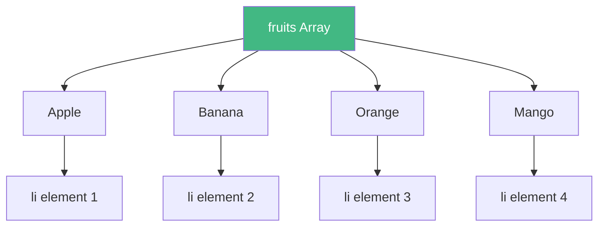

**Important**: Always use `:key` to help Vue track each item!

---

## 8. Computed Properties

**Computed properties** calculate values based on other data. They're cached and only update when dependencies change.

```html
<div id="app">
    <p>First Name: <input v-model="firstName"></p>
    <p>Last Name: <input v-model="lastName"></p>
    <p>Full Name: {{ fullName }}</p>
</div>
```

```javascript
data() {
    return {
        firstName: 'John',
        lastName: 'Doe'
    }
},
computed: {
    fullName() {
        return this.firstName + ' ' + this.lastName;
    }
}
```

**Output**: When you type "Jane" in first name, full name becomes "Jane Doe"

### Why not use methods?

```javascript
// ❌ Method - runs every time template re-renders
methods: {
    getFullName() {
        return this.firstName + ' ' + this.lastName;
    }
}

// ✅ Computed - cached, only updates when firstName/lastName change
computed: {
    fullName() {
        return this.firstName + ' ' + this.lastName;
    }
}
```

---

## 9. Watchers

**Watchers** run code when a specific data property changes.

```html
<div id="app">
    <input v-model="search" placeholder="Search...">
    <p>{{ message }}</p>
</div>
```

```javascript
data() {
    return {
        search: '',
        message: ''
    }
},
watch: {
    search(newValue, oldValue) {
        this.message = `You searched for: ${newValue}`;
    }
}
```

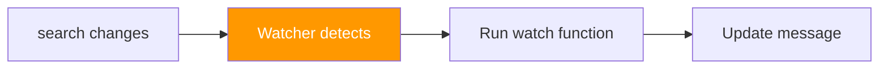

**Use Case**: API calls when user types in search box

---

## 10. Component Basics

Components are reusable pieces of your app.

```javascript
// Define a component
const Counter = {
    data() {
        return {
            count: 0
        }
    },
    template: `
        <div>
            <p>Count: {{ count }}</p>
            <button @click="count++">Increment</button>
        </div>
    `
};

// Use it
createApp({
    components: {
        'my-counter': Counter
    }
}).mount('#app');
```

```html
<div id="app">
    <my-counter></my-counter>
    <my-counter></my-counter>
</div>
```

**Output**: Two independent counters on the page!

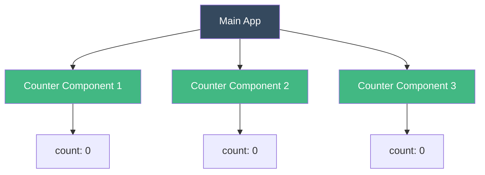

---

## 11. Props (Parent to Child)

**Props** pass data from parent to child component.

```javascript
// Child component
const UserCard = {
    props: ['name', 'age'],
    template: `
        <div class="card">
            <h3>{{ name }}</h3>
            <p>Age: {{ age }}</p>
        </div>
    `
};

// Parent component
createApp({
    components: { UserCard },
    data() {
        return {
            userName: 'Alice',
            userAge: 25
        }
    }
}).mount('#app');
```

```html
<div id="app">
    <user-card :name="userName" :age="userAge"></user-card>
</div>
```

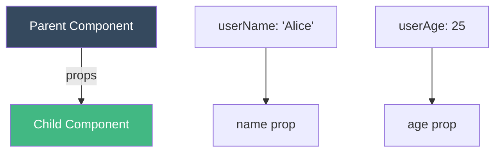

---

## 12. Emits (Child to Parent)

**Emits** send events from child to parent.

```javascript
// Child component
const ClickCounter = {
    template: `
        <button @click="$emit('increment')">Click Me</button>
    `
};

// Parent component
createApp({
    components: { ClickCounter },
    data() {
        return {
            totalClicks: 0
        }
    },
    methods: {
        handleIncrement() {
            this.totalClicks++;
        }
    }
}).mount('#app');
```

```html
<div id="app">
    <p>Total: {{ totalClicks }}</p>
    <click-counter @increment="handleIncrement"></click-counter>
</div>
```

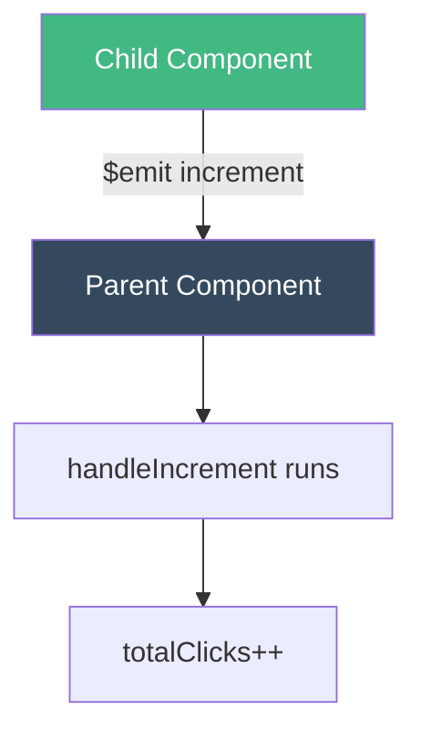

---

## 13. Lifecycle Hooks

Special functions that run at different stages of a component's life.

```javascript
createApp({
    data() {
        return {
            message: 'Hello'
        }
    },
    created() {
        console.log('Component created!');
    },
    mounted() {
        console.log('Component mounted to DOM!');
        // Good place for API calls
    },
    updated() {
        console.log('Component updated!');
    },
    unmounted() {
        console.log('Component removed!');
    }
}).mount('#app');
```

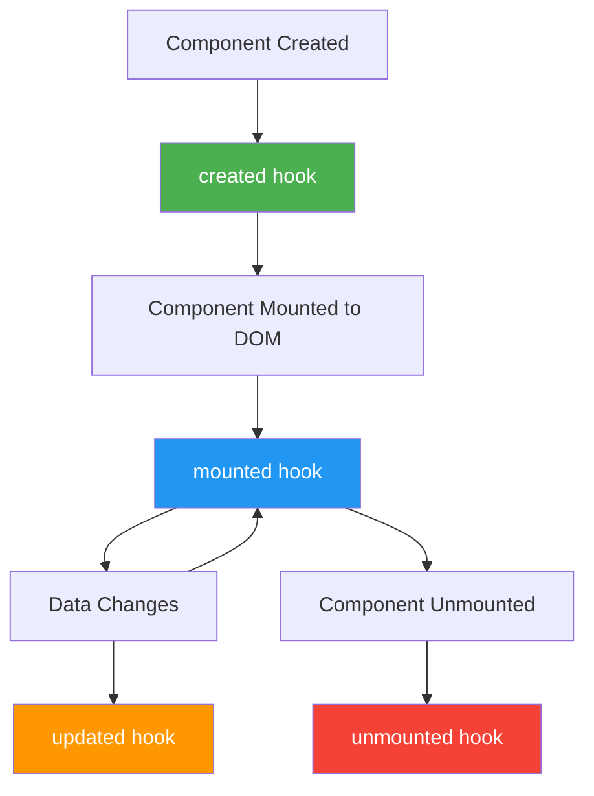

**Common Use Cases**:

- **created**: Initialize data
- **mounted**: API calls, DOM manipulation
- **updated**: React to data changes
- **unmounted**: Cleanup (remove event listeners)

---

## 14. Template Syntax Shortcuts

### Text Interpolation

```html
<p>{{ message }}</p>
```

### Bind Attributes

```html
<!-- Full syntax -->


<!-- Shorthand -->

```

### Event Listeners

```html
<!-- Full syntax -->
<button v-on:click="doSomething">Click</button>

<!-- Shorthand -->
<button @click="doSomething">Click</button>
```

### Class Binding

```html
<!-- Single class -->
<div :class="{ active: isActive }"></div>

<!-- Multiple classes -->
<div :class="{ active: isActive, disabled: isDisabled }"></div>

<!-- Array syntax -->
<div :class="[activeClass, errorClass]"></div>
```

### Style Binding

```html
<div :style="{ color: textColor, fontSize: size + 'px' }"></div>
```

---

## 15. Quick Reference

|Concept|Syntax|Purpose|
|---|---|---|
|**Interpolation**|`{{ data }}`|Display data|
|**Bind Attribute**|`:src="url"`|Dynamic attributes|
|**Event Listener**|`@click="method"`|Handle events|
|**Two-way Binding**|`v-model="data"`|Sync input & data|
|**Conditional**|`v-if="condition"`|Show/hide elements|
|**Loop**|`v-for="item in items"`|Render lists|
|**Props**|`props: ['name']`|Parent → Child data|
|**Emit**|`$emit('event')`|Child → Parent events|

---

## Complete Example: Todo App

```html
<!DOCTYPE html>
<html>
<head>
    <script src="https://cdn.jsdelivr.net/npm/vue@3"></script>
    <style>
        .done { text-decoration: line-through; color: gray; }
    </style>
</head>
<body>
    <div id="app">
        <h1>My Todos</h1>
        
        <!-- Input -->
        <input v-model="newTodo" @keyup.enter="addTodo" placeholder="Add todo">
        <button @click="addTodo">Add</button>
        
        <!-- List -->
        <ul>
            <li v-for="(todo, index) in todos" :key="index">
                <input type="checkbox" v-model="todo.done">
                <span :class="{ done: todo.done }">{{ todo.text }}</span>
                <button @click="removeTodo(index)">Delete</button>
            </li>
        </ul>
        
        <!-- Summary -->
        <p>{{ remaining }} remaining</p>
    </div>

    <script>
        const { createApp } = Vue;
        
        createApp({
            data() {
                return {
                    newTodo: '',
                    todos: [
                        { text: 'Learn Vue', done: false },
                        { text: 'Build a project', done: false }
                    ]
                }
            },
            computed: {
                remaining() {
                    return this.todos.filter(t => !t.done).length;
                }
            },
            methods: {
                addTodo() {
                    if (this.newTodo.trim()) {
                        this.todos.push({
                            text: this.newTodo,
                            done: false
                        });
                        this.newTodo = '';
                    }
                },
                removeTodo(index) {
                    this.todos.splice(index, 1);
                }
            }
        }).mount('#app');
    </script>
</body>
</html>
```

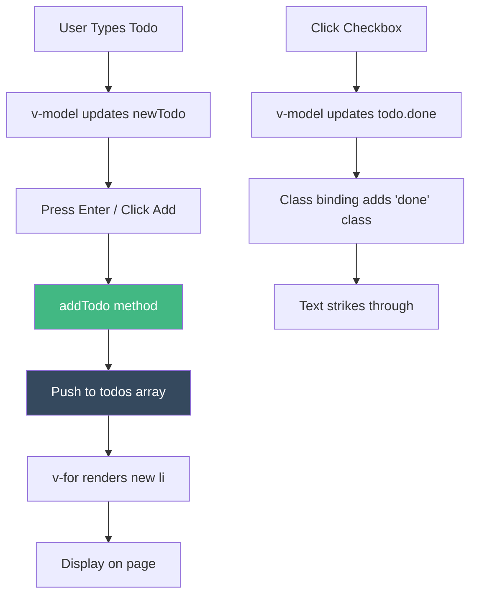

---

## Key Takeaways

✅ **Vue is reactive** - data changes automatically update the UI  
✅ **Use v-model** for two-way binding on inputs  
✅ **v-for needs :key** to track items efficiently  
✅ **Computed properties** are cached and better than methods for calculations  
✅ **Components** make your app reusable and organized  
✅ **Props down, events up** - data flows from parent to child, events bubble up

---

## Next Steps

1. Practice with small projects (todo list, calculator, counter)
2. Learn Vue Router for multi-page apps
3. Explore Vuex/Pinia for state management
4. Build a project with Vue + Flask API
5. Learn Single File Components (.vue files)

**Remember**: Start simple, practice often, build projects! 

**Last Updated**: November 2025
**Status**: Interview Ready ✅